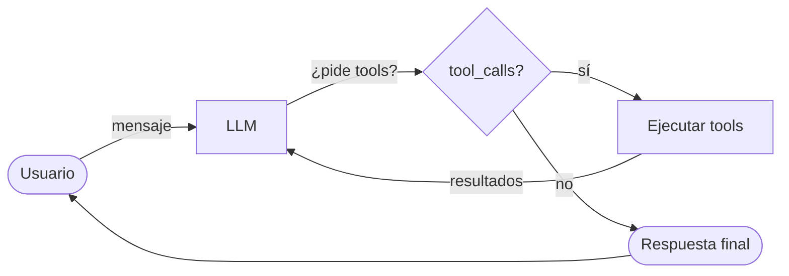
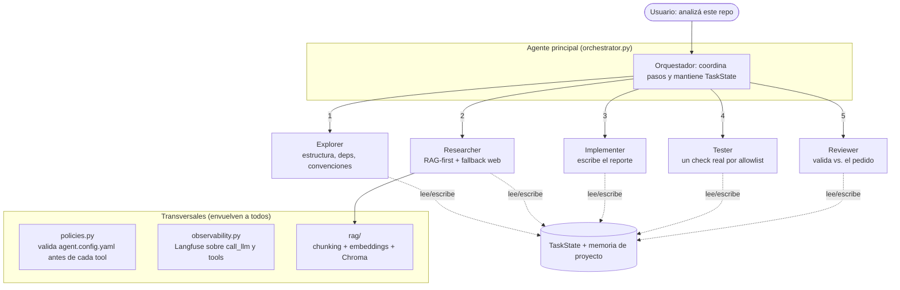
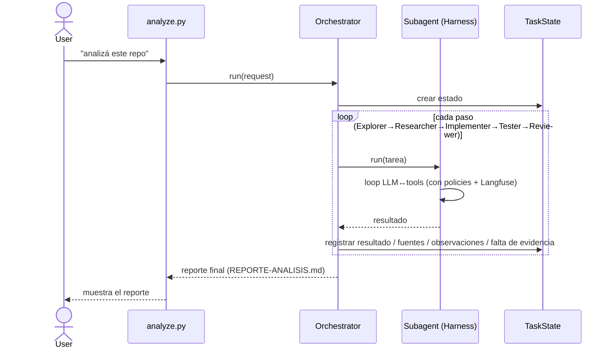
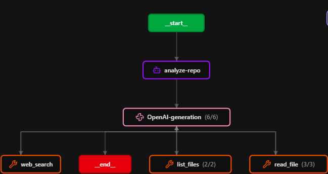

# Coding Agent

Agente de coding potenciado por un LLM (OpenAI) que explora repositorios,
lee/analiza/modifica archivos y ejecuta tareas de forma autónoma a partir de
instrucciones en lenguaje natural. Sobre esa base de un solo agente se construyó
un **sistema multi-agente** (TP Final) cuyo caso de uso es **analizar un repo
desconocido y producir un reporte** (arquitectura, dependencias, riesgos,
comandos), **sin frameworks de orquestación** (prohibidos LangChain, LangGraph,
CrewAI, AutoGen).

> Este README explica **qué es y cómo está pensado** el proyecto (arquitectura y
> conceptos). Para lo operativo —setup, variables de entorno, cómo correrlo—
> ver [`CLAUDE.md`](./CLAUDE.md). El roadmap del TP está en
> [`docs/plan-tp-final.md`](./docs/plan-tp-final.md) y la reflexión de cierre en
> [`docs/cierre-reflexion.md`](./docs/cierre-reflexion.md).

## La idea en una frase

Un agente es, en esencia, un **loop**: el LLM piensa, pide ejecutar herramientas,
ve los resultados, y repite hasta poder responder. Todo lo demás (subagentes,
planificación, políticas, RAG, observabilidad) es andamiaje alrededor de ese loop.

## Dos capas: agente base y capa multi-agente

El proyecto tiene una **base de un solo agente** (el `Harness` y sus tools) y,
encima, una **capa multi-agente** que reutiliza ese mismo motor. La idea central
que mantiene todo consistente y libre de frameworks:

> **Cada subagente es un `Harness`** con su propio system prompt y un `tool_map`
> restringido. El **orquestador** es un loop de más alto nivel que **delega en los
> subagentes como si fueran tools**, pasando un **estado compartido**
> (`TaskState`).

Punto clave: **`harness.py` no conoce las tools concretas ni el rol.** Recibe un
`tool_map` (nombre → función), sus `tool_schemas` y su `system_message` en el
constructor, y despacha por nombre. Un subagente se especializa **solo** cambiando
esos tres ingredientes: el motor es siempre el mismo.

## El paquete `agent/`

El código se separa en dos mundos: el **paquete `agent/`** (el agente en sí) y los
**entry points + setup** en la raíz (`main.py`, `analyze.py`, `run_tests.py`,
`repo.py`). Las dependencias apuntan hacia adentro y no hay ciclos.

### Base (un solo agente)

| Archivo | Rol |
|---|---|
| `agent/harness.py` | El motor: loop LLM↔tools, resumen de contexto, detección de loops, Plan Mode, Supervisión |
| `agent/llm.py` | Único borde con OpenAI: cliente, prompts, `TOOL_SCHEMAS`, `call_llm`, `schemas_for` |
| `agent/tools.py` | Las capacidades reales: `read_file`, `list_files`, `write_file`, `execute_command`, `web_search`, `retrieve` |
| `agent/factory.py` | Wiring: lee env, arma cliente + `tool_map`; `build_harness()` (base) y `build_orchestrator()` (multi-agente) |

### Capa multi-agente (TP Final)

| Archivo | Rol |
|---|---|
| `agent/orchestrator.py` | Agente principal: crea el `TaskState`, ejecuta los pasos (Explorer→Researcher→Implementer→Tester→Reviewer) y arma el reporte |
| `agent/state.py` | `TaskState`: request, progreso, resultados por subagente, fuentes, archivos modificados, observaciones y `missing_evidence` |
| `agent/subagents/base.py` | `Subagent`: corre una tarea en una conversación fresca y registra el resultado en el `TaskState` |
| `agent/subagents/explorer.py` | Solo lectura + memoria (`read_file`, `list_files`, `read_memory`, `remember`) |
| `agent/subagents/researcher.py` | RAG-first: `retrieve` + `web_search` + salida estructurada de fuentes |
| `agent/subagents/implementer.py` | Escritura acotada: solo puede escribir `REPORTE-ANALISIS.md` |
| `agent/subagents/tester.py` | `execute_command` con allowlist: corre un check real sin ser una shell general |
| `agent/subagents/reviewer.py` | Solo lectura: valida el reporte vs. el pedido y deja observaciones |

### Transversales

| Archivo | Rol |
|---|---|
| `agent/policies.py` + `agent.config.yaml` | Gate de veto por config (glob allow/deny) **antes** de cada tool call + lista `approval` para confirmación humana |
| `agent/observability.py` | Instrumentación Langfuse sobre `call_llm` y cada tool; **no-op** sin credenciales |
| `agent/memory.py` | Memoria persistente por proyecto (`.agent_memory.json`) con categorías; tools `read_memory` / `remember` |
| `rag/` (raíz) | Pipeline RAG: `chunking`, `embeddings` (OpenAI), `store` (Chroma), `ingest`; es una capacidad que el agente *usa* vía `retrieve` |
| `repo.py` (raíz) | Clona un repo de GitHub al workspace y hace `chdir` (setup del entorno, **antes** de que el agente exista) |

## Cómo fluye un análisis de repo

El entry point `analyze.py` arma el orquestador y le pasa el pedido. El
orquestador ejecuta la pipeline como una secuencia de pasos; cada paso corre un
subagente y **registra su resultado en el `TaskState`**, del que el siguiente paso
se nutre.

El `TaskState` reemplaza la dependencia implícita del historial conversacional:
en lugar de que cada subagente "recuerde" lo anterior, la coordinación es una
estructura **explícita**. Eso permite que el reporte muestre fuentes,
observaciones del Reviewer y **falta de evidencia** (`missing_evidence`) sin
depender de que el modelo lo recuerde.

## Dos ejes de seguridad (independientes)

- **Policies (preventivo, sin humano)** — `agent.config.yaml` declara `allow`/`deny`
  glob para `read` / `write` / `commands`. `Policies.check()` corre **antes** de
  ejecutar la tool; si deniega, el resultado vuelve al LLM como `Error: ...` (mismo
  patrón que las tools, nunca lanza). `deny` tiene prioridad; `allow` vacío =
  permitir todo salvo `deny`. **Todo** `Harness` de producción —orquestador y cada
  subagente— recibe el mismo set de policies.
- **Supervisión (reactivo, con humano)** — human-in-the-loop: con `/supervise on`,
  las tools de la lista `approval` piden confirmación antes de ejecutarse.

A eso se suman las **tools acotadas** de cada subagente (el `write_file` del
Implementer solo escribe `REPORTE-ANALISIS.md`; el `execute_command` del Tester
solo acepta comandos de su allowlist), que restringen el rol *además* del gate
global.

## Robustez del loop (memoria de contexto)

Dos salvaguardas envuelven el loop del harness:

- **Resumen de contexto** — cuando el historial supera `HISTORY_LIMIT`, los turnos
  viejos se condensan en un resumen (una llamada sin tools) en vez de reenviarse
  enteros.
- **Detección de loops** — si se repiten `LOOP_THRESHOLD` tool calls idénticas, se
  escala: primero se inyecta una señal para replanificar; si persiste, se corta y
  se pide ayuda. Cada intervención queda registrada en `TaskState.observations`,
  así el patrón no queda invisible.

## Los dos modos

Son **ortogonales** (se activan por separado) y viven en el harness:

- **Plan Mode** (`/plan on`) — antes de ejecutar, una llamada al LLM *sin tools*
  propone un plan numerado que aprobás/iterás. Solo cambia **qué input** recibe el
  agente; la ejecución sigue el mismo camino.
- **Supervisión** (`/supervise on`) — confirmación humana antes de las tools de la
  lista `approval`.

## Observabilidad

Con credenciales de Langfuse, cada turno del LLM se traza como *generation* y cada
tool como *span*, todo anidado bajo una traza raíz por caso de uso (`observed_run`).
La instrumentación es un **drop-in** sobre el único borde OpenAI, así que no agrega
un segundo call site; y **sin credenciales es un no-op** que no rompe la corrida.

## Principios de diseño

- **Un nivel de abstracción por función**: `run_conversation` orquesta; el *cómo*
  de ejecutar una tool vive en `_execute_tool_call`.
- **Localidad de lectura**: se prefiere código legible en el lugar antes que
  esconder detalles triviales tras indirecciones. Se encapsula solo cuando hay
  duplicación real o mezcla de niveles.
- **Un solo borde con OpenAI** (`llm.py`): todos los turnos pasan por `call_llm`.
- **Nombres que dicen la verdad**: `TOOL_SCHEMAS` (lo que ve el LLM) vs `tools.py`
  (las implementaciones); `run_tests.py` es una batería de demo, no un test suite.
- **La ubicación refleja la pertenencia**: lo que no es el agente vive fuera de
  `agent/` (`repo.py`, `rag/`).

## Documentación por feature

Cada pieza del TP Final tiene su doc estilo antes/después:

| Doc | Tema |
|---|---|
| [`docs/issue-11-policies.md`](./docs/issue-11-policies.md) | Capa de políticas |
| [`docs/issue-12-researcher.md`](./docs/issue-12-researcher.md) | Researcher (web) |
| [`docs/issue-13-observability.md`](./docs/issue-13-observability.md) | Observabilidad Langfuse |
| [`docs/issue-8-rag.md`](./docs/issue-8-rag.md) | RAG (Chroma + retrieve) |
| [`docs/issue-7-memoria-contexto.md`](./docs/issue-7-memoria-contexto.md) | Memoria y manejo de contexto |
| [`docs/issue-4-implementer-reviewer.md`](./docs/issue-4-implementer-reviewer.md) | Implementer + Reviewer |
| [`docs/issue-5-tester.md`](./docs/issue-5-tester.md) | Tester |

## Origen

Migrado del notebook del TP1 (`tp/coding_agent_Fierro_Mangini.ipynb`) a un
proyecto Python ejecutable sin Colab, y evolucionado hacia el sistema
multi-agente del TP Final.
