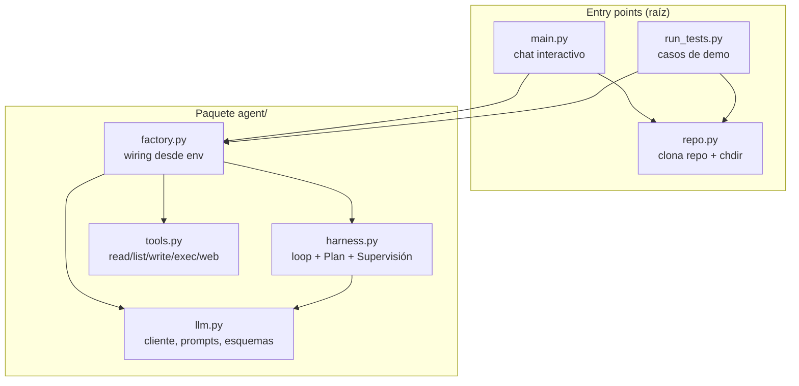
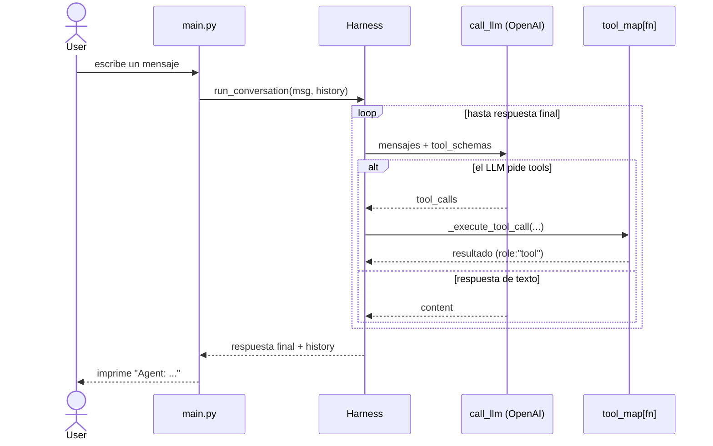

# Coding Agent

Agente de coding potenciado por un LLM (OpenAI) que explora repositorios,
lee/analiza/modifica archivos y ejecuta tareas de forma autónoma a partir de
instrucciones en lenguaje natural.

> Este README explica **qué es y cómo está pensado** el proyecto (arquitectura y
> conceptos). Para lo operativo —setup, variables de entorno, cómo correrlo—
> ver [`CLAUDE.md`](./CLAUDE.md).

## La idea en una frase

Un agente es, en esencia, un **loop**: el LLM piensa, pide ejecutar herramientas,
ve los resultados, y repite hasta poder responder. Todo lo demás (comandos,
planificación, supervisión) es andamiaje alrededor de ese loop.

## Arquitectura

El código se separa en dos mundos: el **paquete `agent/`** (el agente en sí) y
los **entry points + setup** en la raíz. Las dependencias apuntan hacia adentro
y no hay ciclos.

Punto clave: **`harness.py` no conoce las tools concretas.** Recibe un
`tool_map` (nombre → función) y los `tool_schemas` en su constructor, y despacha
por nombre. Agregar una tool no toca el harness: se escribe la función en
`tools.py`, su esquema en `llm.py` y se registra en `factory.py`.

## Responsabilidades

| Archivo | Rol | Depende de |
|---|---|---|
| `main.py` | Bucle del chat CLI, comandos (`/plan`, `/supervise`), muestra respuestas | factory, repo |
| `run_tests.py` | Corre una batería de tareas de ejemplo end-to-end | factory, repo |
| `repo.py` | Clona un repo de GitHub al workspace y hace `chdir` (setup del entorno) | git |
| `agent/factory.py` | Wiring: lee env, arma cliente + `tool_map` y devuelve un `Harness` | tools, harness, llm |
| `agent/harness.py` | El cerebro: loop LLM↔tools, Plan Mode, Supervisión | llm |
| `agent/llm.py` | Borde con OpenAI: cliente, prompts, `TOOL_SCHEMAS`, `call_llm` | openai |
| `agent/tools.py` | Las capacidades reales (filesystem, shell, web) | os, subprocess, tavily |

`repo.py` vive **fuera** de `agent/` a propósito: es preparación del entorno que
corre *antes* de que el agente exista, no una capacidad del agente.

## Cómo fluye una petición

El `conversation_history` es una **lista en memoria** que vive en el entry point
y se pasa de ida y vuelta al harness (que es sin estado). Se siembra con el
`SYSTEM_MESSAGE` vía `harness.new_conversation()` y crece con cada turno.

## Los dos modos

Son **ortogonales** (se activan por separado) y viven en el harness:

- **Plan Mode** (`/plan on`) — antes de ejecutar, una llamada al LLM *sin tools*
  propone un plan numerado que aprobás/iterás. Solo cambia **qué input** recibe el
  agente; la ejecución sigue el mismo camino.
- **Supervisión** (`/supervise on`) — human-in-the-loop: pide confirmación antes
  de las tools que modifican el sistema (`write_file`, `execute_command`).

## Principios de diseño

- **Un nivel de abstracción por función**: `run_conversation` orquesta; el *cómo*
  de ejecutar una tool vive en `_execute_tool_call`.
- **Localidad de lectura**: se prefiere código legible en el lugar antes que
  esconder detalles triviales tras indirecciones. Se encapsula solo cuando hay
  duplicación real o mezcla de niveles.
- **Un solo borde con OpenAI** (`llm.py`): todos los turnos pasan por `call_llm`.
- **Nombres que dicen la verdad**: `TOOL_SCHEMAS` (lo que ve el LLM) vs `tools.py`
  (las implementaciones).

## Origen

Migrado del notebook del TP1 (`tp/coding_agent_Fierro_Mangini.ipynb`) a un
proyecto Python ejecutable sin Colab.
