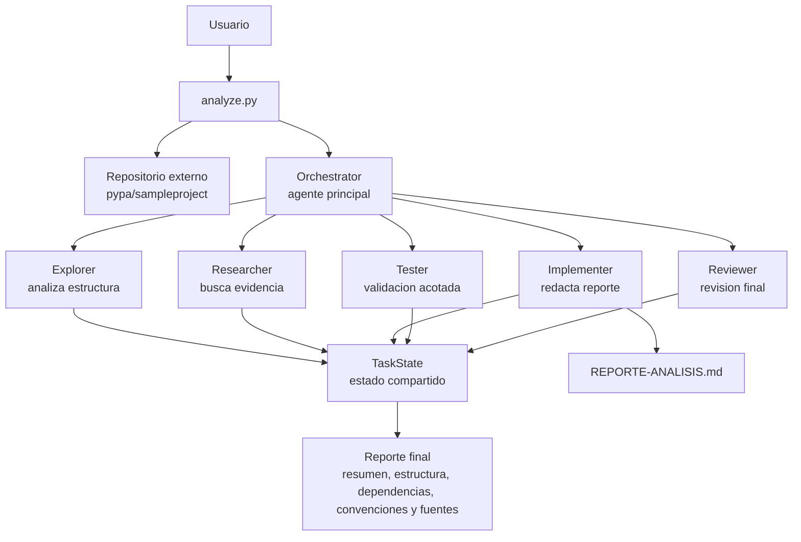

# 3. Caso de uso elegido

## Descripcion breve

El caso de uso elegido fue utilizar el sistema multiagente del proyecto
`coding-agent` para analizar un repositorio externo y generar un reporte tecnico
verificable.

La ejecucion concreta se hizo sobre el repositorio:

```text
pypa/sampleproject
```

Ese repositorio es un proyecto de ejemplo de la Python Packaging Authority
orientado a mostrar como empaquetar y distribuir proyectos Python. Segun el
reporte generado, su objetivo no es representar todas las mejores practicas de
desarrollo Python, sino servir como guia de ejemplo para el tutorial de
empaquetado de Python.

El resultado de la ejecucion quedo documentado en:

```text
REPORTE-ANALISIS.md
```

## Proyecto utilizado

El proyecto utilizado como caso de analisis fue:

```text
https://github.com/pypa/sampleproject
```

Este repositorio fue elegido porque es pequeno, conocido y adecuado para validar
si el agente puede:

- clonar o trabajar sobre un repositorio externo;
- explorar su estructura;
- identificar su objetivo;
- relevar dependencias;
- reconocer convenciones;
- recuperar fuentes;
- generar un reporte final en Markdown.

## Objetivo concreto

El objetivo concreto fue comprobar que el agente pudiera analizar un repositorio
Python de ejemplo y producir un reporte que respondiera preguntas basicas de
entendimiento tecnico:

- que es el repositorio;
- para que sirve;
- como esta organizado;
- que dependencias o componentes relevantes utiliza;
- que convenciones se observan;
- que fuentes respaldan el analisis.

El artefacto esperado era un reporte persistido en:

```text
REPORTE-ANALISIS.md
```

## Diagrama del caso de uso



El diagrama muestra la ejecucion del caso de uso: el usuario inicia `analyze.py`
sobre el repositorio `pypa/sampleproject`; el orquestador coordina subagentes
especializados; cada paso registra resultados en `TaskState`; y el resultado se
materializa en el archivo `REPORTE-ANALISIS.md`.

## Flujo ejecutado

El flujo esperado del caso fue:

1. Ejecutar el analisis del repositorio externo.
2. Explorar la estructura del repositorio.
3. Identificar el objetivo del proyecto.
4. Relevar dependencias y convenciones.
5. Recuperar fuentes para respaldar la respuesta.
6. Redactar el reporte final.
7. Validar el resultado con un check tecnico acotado.
8. Revisar que el reporte responda al pedido original.

El reporte generado incluye las secciones:

- resumen;
- estructura;
- dependencias;
- convenciones;
- fuentes.

## Criterio de cumplimiento

El caso de uso se considera cumplido si el sistema logra:

- analizar el repositorio `pypa/sampleproject`;
- identificar correctamente que se trata de un ejemplo para empaquetado Python;
- generar un reporte Markdown persistido;
- incluir estructura, dependencias y convenciones;
- citar fuentes usadas;
- completar el flujo multiagente hasta la revision final.

En esta entrega, el criterio principal se verifica con la existencia del archivo:

```text
REPORTE-ANALISIS.md
```

y con que su contenido describa el repositorio analizado, su proposito y los
hallazgos principales.
