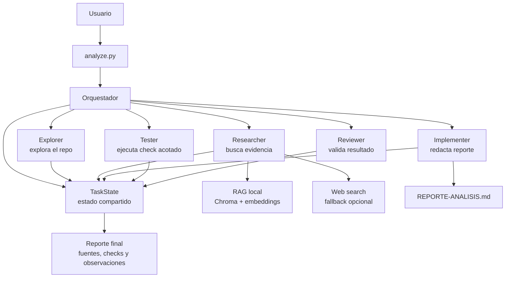

# 3. Caso de uso elegido

## Descripcion breve

El caso de uso elegido es un **coding agent multiagente para analizar
repositorios de software y generar un reporte tecnico verificable**.

El sistema recibe un pedido en lenguaje natural, explora el repositorio actual o
un repositorio clonado desde GitHub, recupera evidencia local o externa, redacta
un reporte, ejecuta una validacion tecnica acotada y revisa si el resultado final
responde al pedido original.

El proyecto utilizado es este repositorio `coding-agent`, migrado desde un
notebook inicial del TP a una aplicacion Python ejecutable. Sobre la base de un
agente de coding con tools se construyo una capa multiagente orientada al caso:

```text
analizar un repo desconocido -> producir un reporte tecnico
```

## Repositorio o proyecto utilizado

El proyecto utilizado es `coding-agent`.

Su objetivo general es implementar un agente capaz de:

- Leer archivos del repositorio.
- Listar estructura de carpetas.
- Escribir archivos de salida.
- Ejecutar comandos controlados.
- Consultar una base RAG local.
- Usar busqueda web como fallback.
- Mantener memoria persistente del proyecto.
- Registrar trazas de ejecucion con Langfuse cuando esta configurado.

El caso de uso principal se ejecuta desde:

```bash
python analyze.py
```

Tambien puede analizarse un repositorio externo:

```bash
python analyze.py --clone https://github.com/usuario/repositorio.git
```

## Objetivo concreto

El objetivo concreto del caso de uso es que el sistema pueda tomar un repositorio
y producir automaticamente un reporte de analisis que incluya, como minimo:

- Que es el proyecto analizado.
- Como esta organizada su estructura.
- Que dependencias usa.
- Que convenciones o patrones aparecen en el codigo.
- Que fuentes o evidencia se utilizaron.
- Que validacion tecnica se ejecuto.
- Que observaciones surgieron en la revision final.

El reporte final se persiste en:

```text
REPORTE-ANALISIS.md
```

## Flujo esperado

El flujo del caso de uso es:

1. El usuario ejecuta `analyze.py` con un pedido en lenguaje natural.
2. El orquestador crea un estado compartido de la tarea.
3. El subagente Explorer inspecciona el repositorio en modo solo lectura.
4. El subagente Researcher busca evidencia adicional, primero en RAG y luego en
   web si hace falta.
5. El subagente Implementer redacta y guarda el reporte.
6. El subagente Tester ejecuta un check tecnico acotado.
7. El subagente Reviewer valida que el reporte responda al pedido original.
8. El orquestador devuelve el reporte final con fuentes, checks y observaciones.

## Diagrama del caso de uso



El diagrama muestra el flujo completo del caso de uso. El usuario inicia la
ejecucion desde `analyze.py`, que construye el orquestador. El orquestador
coordina a los subagentes y todos registran sus resultados en `TaskState`, el
estado compartido de la tarea. El Researcher consulta primero la base RAG local
y solo usa web como fallback. El Implementer genera `REPORTE-ANALISIS.md`, el
Tester ejecuta una validacion acotada y el Reviewer revisa que el reporte
responda al pedido original. Finalmente, el sistema devuelve un reporte con
fuentes, checks y observaciones.

## Criterio de cumplimiento

El caso de uso se considera cumplido cuando se verifica que el sistema:

- Ejecuta el flujo completo sin depender de un framework externo de
  orquestacion.
- Usa subagentes con roles diferenciados.
- Comparte estado entre los pasos mediante `TaskState`.
- Recupera evidencia con una estrategia RAG-first.
- Genera el archivo `REPORTE-ANALISIS.md`.
- Ejecuta al menos un check tecnico real mediante el subagente Tester.
- Realiza una revision final mediante el subagente Reviewer.
- Explicita fuentes utilizadas y faltas de evidencia cuando corresponde.

En terminos practicos, una ejecucion exitosa debe poder correrse con:

```bash
python analyze.py "Analiza este repositorio y explica su arquitectura"
```

y debe terminar mostrando el reporte por consola y dejando persistido el archivo
`REPORTE-ANALISIS.md`.

## Alcance

El alcance del caso se centra en **analisis y documentacion tecnica de
repositorios**. No busca reemplazar un proceso completo de desarrollo, sino
automatizar una primera lectura estructurada del proyecto y producir evidencia
util para entenderlo.

Quedan dentro del alcance:

- Analizar estructura y archivos relevantes.
- Identificar dependencias.
- Generar reportes Markdown.
- Consultar evidencia local mediante RAG.
- Complementar con busqueda web si RAG no alcanza.
- Ejecutar checks seguros y acotados.
- Registrar observaciones de revision.

Quedan fuera del alcance principal:

- Hacer cambios funcionales complejos en proyectos externos.
- Ejecutar suites de tests arbitrarias sin allowlist.
- Administrar despliegues.
- Reemplazar una auditoria humana completa.
