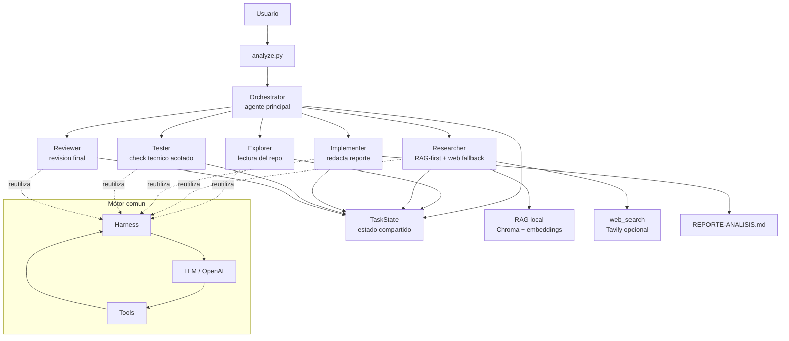

# 4. Arquitectura

## Descripcion general

La arquitectura del proyecto esta organizada como un sistema **multiagente**
construido sobre un motor comun llamado `Harness`.

La idea principal es que todos los agentes comparten el mismo mecanismo base:

```text
LLM -> tool calls -> ejecucion de tools -> resultado -> LLM
```

Sobre ese loop se construye una capa de orquestacion. El agente principal no
resuelve toda la tarea directamente, sino que divide el trabajo en subagentes con
roles especificos y permisos acotados.

El caso de uso principal es:

```text
analizar un repositorio -> producir un reporte tecnico verificable
```

## Diagrama de arquitectura



El diagrama muestra que `analyze.py` es el punto de entrada del caso de uso. Ese
archivo construye el `Orchestrator`, que actua como agente principal. El
orquestador coordina a los subagentes y mantiene un `TaskState`, donde se guarda
la informacion compartida entre pasos. Cada subagente reutiliza el mismo motor
`Harness`, pero con instrucciones y herramientas distintas.

## Rol del agente principal

El agente principal es el `Orchestrator`, implementado en:

```text
agent/orchestrator.py
```

Su responsabilidad es coordinar el flujo completo del analisis. Para cada pedido
del usuario:

1. Crea un `TaskState` con el pedido original.
2. Delega la exploracion del repositorio al Explorer.
3. Delega la busqueda de evidencia al Researcher.
4. Delega la redaccion del reporte al Implementer.
5. Delega la validacion tecnica al Tester.
6. Delega la revision final al Reviewer.
7. Arma la respuesta final usando el estado compartido.

El orquestador no ejecuta directamente las tareas tecnicas de cada rol. Su valor
esta en ordenar el trabajo, pasar contexto entre pasos y consolidar el resultado.

## Rol de cada subagente

### Explorer

El Explorer se encarga de entender el repositorio.

Archivo:

```text
agent/subagents/explorer.py
```

Responsabilidades:

- Listar archivos y carpetas.
- Leer archivos relevantes.
- Identificar estructura general.
- Identificar dependencias.
- Detectar convenciones del proyecto.
- Consultar y actualizar la memoria persistente del proyecto.

Herramientas principales:

- `list_files`
- `read_file`
- `read_memory`
- `remember`

Es un subagente de solo lectura sobre el repositorio, salvo por la memoria
persistente.

### Researcher

El Researcher cubre la falta de evidencia.

Archivo:

```text
agent/subagents/researcher.py
```

Responsabilidades:

- Consultar primero la base RAG local.
- Usar busqueda web solo si RAG no alcanza.
- Distinguir el origen de cada fuente.
- Devolver fuentes estructuradas.
- Explicitar cuando algo queda como inferencia o falta de evidencia.

Herramientas principales:

- `retrieve`
- `web_search`
- `submit_research_result`

Su estrategia es **RAG-first**: primero consulta evidencia local indexada en
Chroma y luego, si hace falta, usa Tavily como fallback web.

### Implementer

El Implementer redacta el reporte final.

Archivo:

```text
agent/subagents/implementer.py
```

Responsabilidades:

- Tomar el material generado por Explorer y Researcher.
- Redactar un reporte Markdown.
- Persistir el resultado en `REPORTE-ANALISIS.md`.

Herramienta principal:

- `write_file`

La escritura esta acotada: el Implementer solo puede escribir el archivo
`REPORTE-ANALISIS.md`. Esto evita que el subagente modifique archivos arbitrarios
del repositorio.

### Tester

El Tester ejecuta una validacion tecnica real pero controlada.

Archivo:

```text
agent/subagents/tester.py
```

Responsabilidades:

- Ejecutar un check permitido.
- Reportar si paso o fallo.
- Registrar observaciones si aparece un error.

Herramienta principal:

- `execute_command`

Aunque usa una tool de ejecucion de comandos, no funciona como una shell libre.
El comando esta restringido por allowlist. El check definido por defecto es:

```bash
python3 -m compileall agent rag analyze.py main.py run_tests.py repo.py
```

### Reviewer

El Reviewer valida el resultado final.

Archivo:

```text
agent/subagents/reviewer.py
```

Responsabilidades:

- Leer el reporte generado.
- Verificar si responde al pedido original.
- Contrastar con el repositorio si hace falta.
- Registrar observaciones estructuradas.

Herramientas principales:

- `read_file`
- `list_files`
- `submit_review_result`

Es un subagente de solo lectura. No escribe archivos ni ejecuta comandos.

## Estado compartido

El estado compartido se implementa con `TaskState`.

Archivo:

```text
agent/state.py
```

`TaskState` funciona como la memoria de trabajo de una ejecucion. Permite que los
subagentes no dependan solamente del historial conversacional, sino de una
estructura explicita.

Campos principales:

- `request`: pedido original del usuario.
- `progress`: pasos ejecutados durante la tarea.
- `subagent_results`: resultado final de cada subagente.
- `sources`: fuentes recuperadas por el Researcher.
- `modified_files`: archivos modificados durante la ejecucion.
- `observations`: observaciones transversales.
- `missing_evidence`: faltas de evidencia detectadas.

Cada subagente escribe su resultado en este estado. Luego el orquestador usa esa
informacion para componer el reporte final.

## Memoria persistente

Ademas del estado vivo de una ejecucion, el sistema tiene memoria persistente por
proyecto.

Archivo:

```text
agent/memory.py
```

La memoria se guarda en:

```text
.agent_memory.json
```

Esta memoria permite conservar informacion estable entre corridas, por ejemplo:

- arquitectura;
- dependencias;
- comandos;
- convenciones;
- decisiones;
- bugs;
- resumenes.

El Explorer puede leer esta memoria al empezar y actualizarla cuando confirma
informacion util.

## Motor comun: Harness

Todos los agentes reutilizan el mismo motor `Harness`.

Archivo:

```text
agent/harness.py
```

El `Harness` implementa el loop principal:

1. Envia el historial al LLM.
2. Recibe una respuesta.
3. Si la respuesta pide tools, ejecuta las tools permitidas.
4. Devuelve los resultados al LLM.
5. Repite hasta obtener una respuesta final.

Tambien incluye:

- Plan Mode.
- Supervision humana.
- Resumen de contexto largo.
- Deteccion de loops.
- Validacion de politicas antes de ejecutar tools.

Cada subagente es un `Harness` con:

- un prompt de sistema propio;
- un conjunto de tools acotado;
- schemas de tools especificos;
- las mismas politicas globales de seguridad.

## Politicas y seguridad

Las politicas estan definidas en:

```text
agent.config.yaml
```

y se cargan desde:

```text
agent/policies.py
```

Antes de ejecutar una tool, el sistema valida si la accion esta permitida. Las
politicas definen restricciones para:

- lectura de archivos;
- escritura de archivos;
- ejecucion de comandos;
- tools que requieren aprobacion humana.

Esto se complementa con restricciones propias de cada subagente. Por ejemplo, el
Implementer solo puede escribir el reporte final y el Tester solo puede ejecutar
el comando definido por allowlist.

## Observabilidad

La observabilidad esta implementada en:

```text
agent/observability.py
```

Cuando las credenciales de Langfuse estan configuradas, el sistema registra:

- una traza raiz por ejecucion;
- generaciones del LLM;
- llamadas a tools;
- latencia;
- errores;
- entradas y salidas relevantes.

Si Langfuse no esta configurado, la observabilidad funciona como no-op y no
interrumpe la ejecucion.

