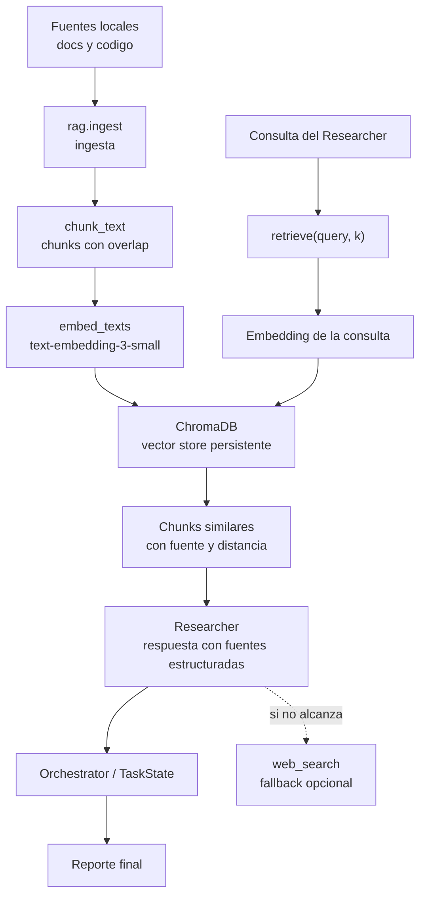

# 5. Documentacion de la base RAG

## Descripcion general

El proyecto incorpora una base **RAG** (*Retrieval-Augmented Generation*) para
que el agente pueda recuperar evidencia local antes de recurrir a busqueda web o
inferencia.

La base RAG se usa principalmente por el subagente **Researcher**, cuyo rol es
cubrir faltas de evidencia durante el analisis de un repositorio. Su regla de
trabajo es:

```text
consultar primero RAG -> usar web_search solo si RAG no alcanza
```

La implementacion esta ubicada en la carpeta:

```text
rag/
```

y se integra al agente mediante la tool:

```text
retrieve
```

## Diagrama del flujo RAG



El diagrama muestra dos momentos. Primero ocurre la ingesta: los archivos locales
se leen, se dividen en chunks, se transforman en embeddings y se guardan en
ChromaDB. Luego, durante una ejecucion del agente, el Researcher hace una
consulta con `retrieve`; esa consulta tambien se convierte en embedding y se
buscan los chunks mas similares. Si la evidencia recuperada no alcanza, el
Researcher puede usar `web_search` como fallback.

## Fuentes utilizadas

Las fuentes de la base RAG son archivos locales del proyecto o del repositorio
que se quiera analizar.

El ingestor acepta archivos de texto y codigo con extensiones conocidas, entre
ellas:

- `.md`
- `.txt`
- `.rst`
- `.py`
- `.js`
- `.ts`
- `.java`
- `.go`
- `.rb`
- `.yaml`
- `.yml`
- `.toml`
- `.json`
- `.cfg`
- `.ini`
- `.sh`

Estas extensiones estan definidas en:

```text
rag/ingest.py
```

En este proyecto, las fuentes mas relevantes para ingestar son:

- `README.md`
- `CLAUDE.md`
- `docs/`
- archivos Python de `agent/`
- archivos Python de `rag/`

Ejemplo de ingesta de documentacion:

```bash
python -m rag.ingest docs
```

Ejemplo de ingesta de un archivo puntual:

```bash
python -m rag.ingest README.md
```

## Estrategia de chunking

El chunking esta implementado en:

```text
rag/chunking.py
```

La funcion principal es:

```text
chunk_text(text, chunk_size=1000, overlap=200)
```

La estrategia elegida es dividir el texto por caracteres en ventanas de hasta
**1000 caracteres**, con **200 caracteres de solapamiento** entre chunks
consecutivos.

Esta estrategia se eligio porque es simple, estable y suficiente para documentos
de repositorio, como Markdown, configuraciones y codigo fuente. El solapamiento
evita perder contexto cuando una idea queda partida entre dos fragmentos.

Ejemplo conceptual:

```text
Chunk 1: caracteres 0 a 1000
Chunk 2: caracteres 800 a 1800
Chunk 3: caracteres 1600 a 2600
```

Cada chunk no vacio se guarda en orden y luego se embebe.

## Embeddings

Los embeddings estan implementados en:

```text
rag/embeddings.py
```

El modelo utilizado es:

```text
text-embedding-3-small
```

La funcion `embed_texts(client, texts)` recibe una lista de textos y devuelve un
vector por cada texto, manteniendo el mismo orden de entrada.

Se reutiliza el cliente de OpenAI compartido por el proyecto. Esto evita tener
multiples bordes de integracion con OpenAI y permite que, si Langfuse esta
configurado, las llamadas tambien queden instrumentadas.

## Almacenamiento elegido

El almacenamiento vectorial elegido es **ChromaDB**.

La implementacion esta en:

```text
rag/store.py
```

La clase principal es:

```text
RagStore
```

`RagStore` se encarga de:

- recibir documentos;
- dividirlos en chunks;
- generar embeddings;
- guardar chunks, embeddings y metadata;
- consultar los chunks mas similares a una pregunta.

La coleccion de Chroma se llama:

```text
rag_docs
```

El directorio de persistencia se define con:

```env
RAG_PERSIST_DIR=./rag_store
```

Si no se configura esa variable, el valor por defecto es:

```text
./rag_store
```

Ese directorio esta incluido en `.gitignore`, porque es un artefacto local
generado durante la ingesta.

## Metadata guardada

Por cada chunk se guarda:

- `id`: compuesto por el identificador del documento y el numero de chunk.
- `document`: texto del chunk.
- `embedding`: vector generado por OpenAI.
- `metadata.source`: ruta o fuente original del documento.

El uso de `upsert` permite reingestar el mismo documento sin duplicar chunks: los
ids derivados del documento reemplazan versiones anteriores.

## Recuperacion de informacion

La recuperacion se expone al agente mediante la tool:

```text
retrieve(query, k=4)
```

Esta tool se construye en:

```text
agent/tools.py
```

y se conecta con Chroma desde:

```text
agent/factory.py
```

El proceso de recuperacion es:

1. El Researcher formula una consulta.
2. `retrieve` genera un embedding de esa consulta.
3. Chroma busca los `k` chunks mas similares.
4. La tool devuelve cada chunk con su fuente y distancia.
5. El Researcher decide si esa evidencia alcanza.
6. Si alcanza, registra fuentes de origen `rag`.
7. Si no alcanza, puede usar `web_search`.

La salida de `retrieve` incluye el prefijo:

```text
FUENTE_RAG:
```

Ese prefijo ayuda al Researcher a transferir la fuente recuperada a su salida
estructurada.

Ejemplo conceptual de salida:

```text
FUENTE_RAG: docs/issue-8-rag.md (distancia 0.1234)
Texto del chunk recuperado...
```

## Integracion con el Researcher

El subagente Researcher esta definido en:

```text
agent/subagents/researcher.py
```

Sus tools principales son:

- `retrieve`
- `web_search`
- `submit_research_result`

El prompt del Researcher obliga a consultar primero `retrieve`. Solo puede usar
`web_search` si:

- el indice RAG esta vacio;
- Chroma no esta disponible;
- los chunks recuperados no responden la pregunta;
- la evidencia local es insuficiente.

Al final, el Researcher registra una respuesta estructurada con fuentes. Cada
fuente tiene:

- `origen`: puede ser `repo`, `memoria`, `rag`, `web` o `inferencia`.
- `referencia`: archivo, chunk, URL o descripcion breve.

Luego el orquestador copia esas fuentes al `TaskState` para incluirlas en el
reporte final.

## Degradacion controlada

El sistema esta preparado para seguir funcionando aunque RAG no este disponible.

Si `chromadb` no esta instalado o no se puede crear el store, `make_rag_store`
devuelve `None`.

En ese caso, `make_retrieve` crea un stub que responde:

```text
Error: retrieve unavailable
```

Esto permite que el Researcher no rompa la ejecucion y pueda:

- usar `web_search` si esta disponible;
- o marcar falta de evidencia si tampoco hay busqueda web.

La misma idea se usa con `web_search`: si falta `TAVILY_API_KEY`, la tool queda
como stub y devuelve que no esta disponible.

## Comandos utiles

Ingestar documentacion:

```bash
python -m rag.ingest docs
```

Ingestar el README:

```bash
python -m rag.ingest README.md
```

Ejecutar el analisis usando el sistema multiagente:

```bash
python analyze.py "Analiza este repositorio y explica su arquitectura"
```

Verificar que los modulos principales compilan:

```bash
python -m compileall agent rag analyze.py main.py run_tests.py repo.py
```