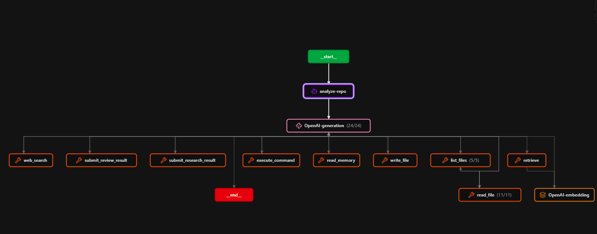
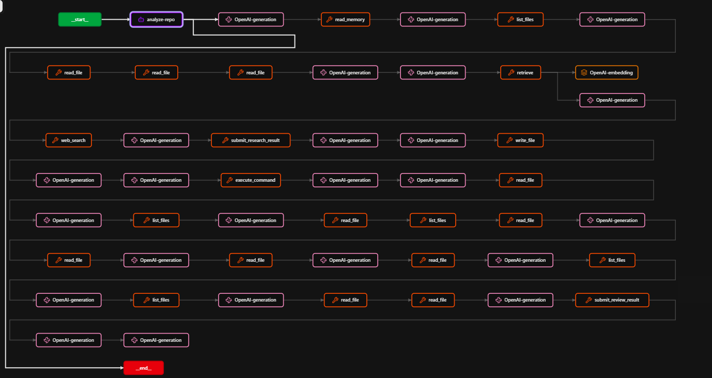
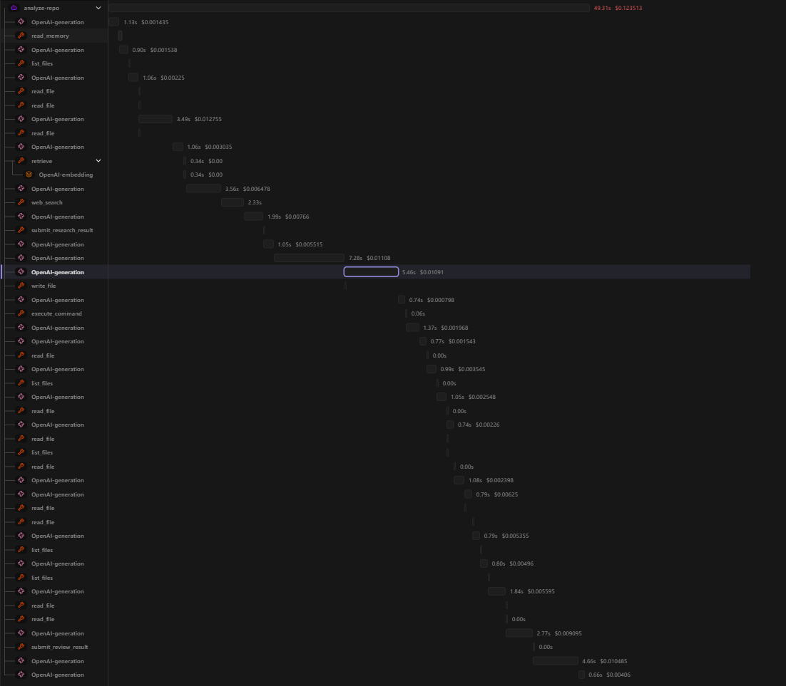

# 7. Evidencia de observabilidad

## Descripcion general

Para evidenciar la observabilidad del sistema se utilizo una traza completa
exportada desde Langfuse.

La traza corresponde a una ejecucion del caso de uso:

```text
analyze-repo
```

Pedido ejecutado:

```text
Analiza arquitectura, dependencias, riesgos y comandos
```

Trace ID:

```text
0ea16ca27d06350f0188d59aeeb489d9
```

Archivo exportado:

```text
trace-0ea16ca27d06350f0188d59aeeb489d9 (1).json
```

Esta nueva traza es mas completa para la consigna porque incluye tanto
recuperacion RAG como busqueda web.

## Captura 1: vista resumida de la traza



En esta captura se observa la traza completa como un grafo resumido. El nodo raiz
es `analyze-repo`, que representa la ejecucion completa del caso de uso. Debajo
aparecen las llamadas al modelo y las tools utilizadas.

Elementos visibles:

- `_start_`: inicio de la ejecucion.
- `analyze-repo`: traza raiz del caso de uso.
- `OpenAI-generation`: llamadas al LLM.
- `read_memory`: consulta de memoria persistente.
- `list_files`: exploracion de archivos.
- `read_file`: lectura de archivos relevantes.
- `retrieve`: recuperacion desde la base RAG.
- `OpenAI-embedding`: embedding usado para consultar RAG.
- `web_search`: busqueda web como fallback o complemento.
- `submit_research_result`: registro estructurado del resultado del Researcher.
- `write_file`: escritura del reporte.
- `execute_command`: check tecnico ejecutado por el Tester.
- `submit_review_result`: registro de observaciones del Reviewer.
- `_end_`: fin de la ejecucion.

Esta vista permite comprobar que el flujo no fue una respuesta directa del LLM:
hubo exploracion del repositorio, recuperacion RAG, busqueda web, escritura de
archivo, ejecucion de comandos y revision final.

## Captura 2: grafo completo de ejecucion



La segunda captura muestra la ejecucion expandida. Ahi se ve el orden real de las
iteraciones entre generaciones del LLM y tools.

Secuencia observada:

1. Inicio de `analyze-repo`.
2. Generacion inicial del LLM.
3. Consulta a memoria con `read_memory`.
4. Listado del repositorio con `list_files`.
5. Lecturas de archivos clave con `read_file`.
6. Recuperacion RAG con `retrieve`.
7. Generacion de embedding con `OpenAI-embedding`.
8. Busqueda web con `web_search`.
9. Registro del resultado de investigacion con `submit_research_result`.
10. Escritura del reporte con `write_file`.
11. Ejecucion del check con `execute_command`.
12. Lecturas y listados adicionales realizados por el Reviewer.
13. Registro del veredicto final con `submit_review_result`.
14. Cierre de la traza.

Esta captura muestra las iteraciones del agente: el LLM decide una accion,
invoca una tool, recibe el resultado y continua con la siguiente decision.

## Captura 3: timeline de la ejecucion



La tercera captura muestra la traza en formato timeline. Esta vista permite ver
cuanto tarda cada paso y como se distribuyen las llamadas durante la ejecucion.

En la parte superior se observa la duracion total:

```text
49.31 s
```

y el costo total estimado:

```text
USD 0.123513
```

La linea de tiempo muestra que las tools locales, como `read_file`, `list_files`,
`write_file` y `execute_command`, son muy rapidas. En cambio, la mayor parte del
tiempo y del costo se concentra en las generaciones `OpenAI-generation`. Tambien
se observa la llamada `OpenAI-embedding` asociada a `retrieve`, que corresponde a
la consulta sobre la base RAG.

## Metricas principales del trace

Del JSON exportado se obtuvieron las siguientes metricas:

| Metrica | Valor |
|---|---:|
| Observaciones totales | 49 |
| Agentes raiz | 1 |
| Generaciones OpenAI | 24 |
| Tools ejecutadas | 23 |
| Embeddings OpenAI | 1 |
| Duracion total | 49.311 s |
| Tokens totales aproximados | 52.805 |
| Costo total aproximado | USD 0.123513 |

Distribucion por nombre de observacion:

| Observacion | Cantidad |
|---|---:|
| `OpenAI-generation` | 24 |
| `read_file` | 11 |
| `list_files` | 5 |
| `read_memory` | 1 |
| `retrieve` | 1 |
| `OpenAI-embedding` | 1 |
| `web_search` | 1 |
| `submit_research_result` | 1 |
| `write_file` | 1 |
| `execute_command` | 1 |
| `submit_review_result` | 1 |
| `analyze-repo` | 1 |

## Cobertura de los puntos requeridos

La consigna pide registrar prompts, modelo, llamadas al LLM, tools, documentos
recuperados, busquedas web, iteraciones, errores, latencia, tokens, costo
estimado y resultado final.

En esta traza se observa:

| Punto requerido | Estado | Evidencia en Langfuse |
|---|---|---|
| Prompts | Registrado | En `input.messages` de cada `OpenAI-generation` |
| Modelo utilizado | Registrado | `model: gpt-4o-2024-08-06` |
| Llamadas al LLM | Registrado | 24 eventos `OpenAI-generation` |
| Tools invocadas | Registrado | 23 eventos `TOOL` |
| Documentos recuperados | Registrado | `retrieve` devuelve chunks RAG con `FUENTE_RAG` |
| Busquedas web | Registrado | Evento `web_search` con resultados de Tavily |
| Iteraciones | Registrado | Secuencia generation -> tool -> generation en el grafo expandido |
| Errores | Registrado si ocurren | No se observan errores criticos en esta ejecucion |
| Latencia | Registrado | `latency` por observacion y total de 49.311 s |
| Tokens | Registrado | `usageDetails`, total aproximado 52.805 |
| Costo estimado | Registrado | `costDetails`, total aproximado USD 0.123513 |
| Resultado final | Registrado | Output del Reviewer y observaciones finales |

## Documentos y fuentes recuperadas

La tool `retrieve` consulto la base RAG con:

```text
arquitectura, dependencias, riesgos y comandos del repositorio
```

El resultado recupero chunks de:

```text
rag/sources/python/python-ecosystem-guide.md
```

Los chunks recuperados contenian criterios para analizar repositorios Python,
incluyendo:

- `pyproject.toml`;
- dependencias runtime y de desarrollo;
- riesgos frecuentes;
- entrypoints;
- configuracion;
- tests;
- comandos de checks como `compileall`, `pytest`, `unittest` y `ruff`;
- uso recomendado de `pypa/sampleproject` como repositorio de referencia.

Ademas, la tool `web_search` consulto:

```text
Python repo architecture with pyproject.toml and noxfile.py
```

y recupero fuentes web sobre:

- documentacion de Nox;
- especificacion de `pyproject.toml`;
- gestion de proyectos Python con `pyproject.toml`;
- ejemplos y herramientas relacionadas con configuracion Python.

## Check ejecutado

El Tester ejecuto:

```bash
python3 -m compileall .
```

El resultado fue exitoso. La salida muestra compilacion de archivos como:

- `noxfile.py`;
- `src/sample/__init__.py`;
- `src/sample/simple.py`;
- `tests/__init__.py`;
- `tests/test_simple.py`.

Esto evidencia que el flujo no solo genero texto, sino que tambien ejecuto una
validacion tecnica real sobre el repositorio analizado.

## Resultado final observado

El Reviewer registro el veredicto:

```text
El reporte responde adecuadamente al pedido.
```

Observaciones principales del Reviewer:

- El reporte cubre la estructura del proyecto y menciona archivos/directorios
  clave.
- Las dependencias estan alineadas con `pyproject.toml`.
- Las convenciones de estilo y automatizacion son consistentes con `flake8`,
  `pytest` y Nox.
- La seccion de riesgos es limitada, pero razonable segun la evidencia
  disponible.
- El apartado de comandos es limitado, aunque menciona `pyproject.toml` y
  `noxfile.py`.
- La carpeta `.github/workflows` confirma uso de GitHub Actions para testing y
  releases automatizados.

## Conclusion

La traza de Langfuse demuestra una ejecucion completa del caso de uso
`analyze-repo`. Se observan prompts, modelo, llamadas al LLM, tools invocadas,
documentos recuperados por RAG, busqueda web, iteraciones, latencia, tokens,
costo estimado, check tecnico y resultado final.

Con esta evidencia se cumple el punto 7 del trabajo: hay capturas de pantalla de
la herramienta de observabilidad y una traza completa que permite auditar el
comportamiento del agente de punta a punta.
