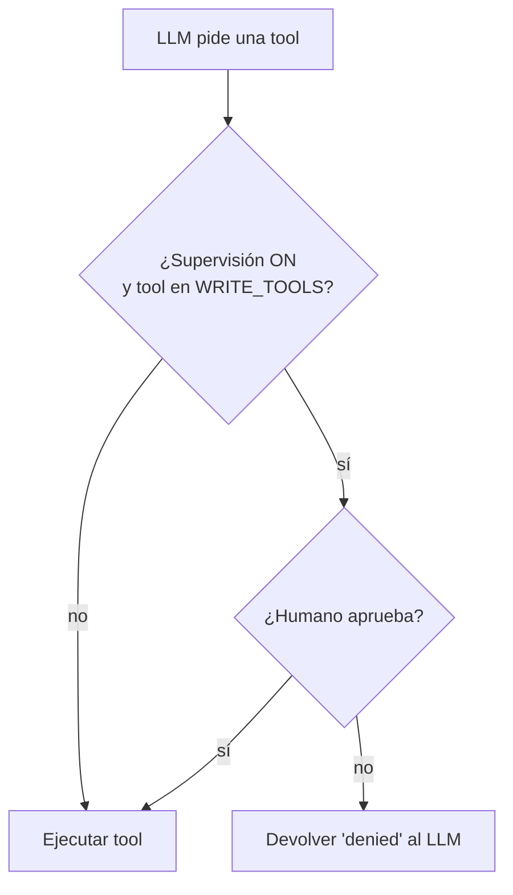
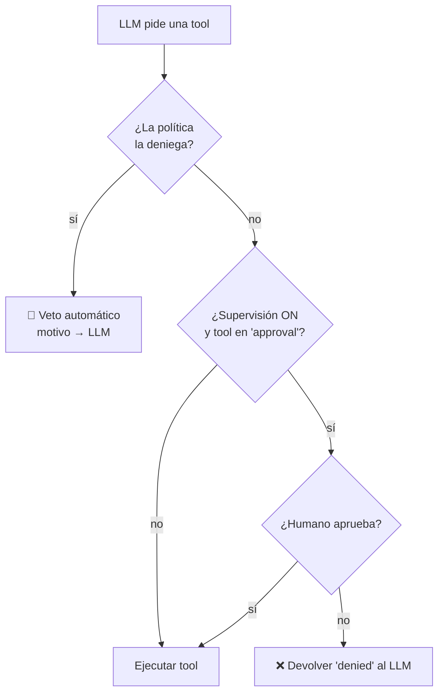

# Issue #11 — Capa de políticas

Antes y después de la PR #11: cómo el agente pasó de **un único gate reactivo
hardcodeado** a **dos gates —veto por config + confirmación humana— con una sola
fuente de verdad aplicada por igual a todos los agentes**.

> Este doc explica **qué cambió y por qué**. Para el detalle operativo de la
> config, ver los comentarios de [`agent.config.yaml`](../agent.config.yaml) y la
> sección `agent/policies.py` en [`CLAUDE.md`](../CLAUDE.md).

## El problema

El único control de seguridad que existía era la **Supervisión**: si estaba
activa, el agente te pedía confirmación antes de correr una tool de escritura.
Qué tools eran "de escritura" estaba clavado en el código:

```python
WRITE_TOOLS = {"write_file", "execute_command"}
```

Eso tenía tres límites:

1. **Solo protege si hay un humano mirando.** Con la Supervisión apagada (p. ej.
   una corrida automática de `analyze.py`), no había ninguna red: el LLM podía
   escribir `.env`, tocar `.git/` o correr `rm -rf` sin que nada lo frenara.
2. **Es reactivo, no preventivo.** Pregunta "¿lo hago?", pero no puede *vetar*
   por regla. Toda la decisión recae en el humano del momento.
3. **La lista está hardcodeada.** Cambiar qué se controla implicaba tocar código.

## El antes



Un solo gate. Sin humano, todo pasa.

## El después

La PR suma un **gate de políticas** que corre **primero** y de forma
**preventiva**: lee `agent.config.yaml` y veta rutas/comandos prohibidos sin
preguntarle a nadie. La confirmación humana queda como segundo gate.



### Dos gates, dos naturalezas

|  | Gate de políticas (nuevo) | Confirmación humana (ya existía) |
|---|---|---|
| **Tipo** | Preventivo: **veta** solo | Reactivo: **pregunta** |
| **Decide** | La config, de antemano | Un humano, en el momento |
| **Alcance** | ¿esta *ruta/comando concreto* está prohibido? | ¿esta *tool* requiere OK? |
| **Sirve sin humano** | **Sí** — protege siempre | No |
| **Fuente** | secciones `read`/`write`/`commands` del yaml | lista `approval` del yaml |

### La config

```yaml
policies:
  read:
    allow: []            # vacío = permitir todo salvo lo de deny
    deny: [".env", "**/.env", "**/secrets/**"]
  write:
    allow: []
    deny: [".env", "**/.env", "**/.git/**"]
  commands:
    allow: []
    deny: ["*rm -rf*", "*sudo*", "*shutdown*", "*mkfs*"]
  approval:              # qué tools piden confirmación con Supervisión ON
    - write_file
    - execute_command
```

Reglas de evaluación (en `agent/policies.py`): **`deny` tiene prioridad**;
`allow` vacío = permitir todo lo que no esté en `deny`; `allow` no vacío = solo
lo que matchee (allowlist). Las tools sin sección (p. ej. `web_search`) no están
gobernadas.

### Dónde engancha

Todo vive dentro de `Harness._execute_tool_call`, el método que ya aislaba el
"cómo" de ejecutar una tool. El gate de políticas es un `elif` previo al bloque
que ejecuta; si veta, el motivo vuelve al LLM como contenido de un mensaje
`role:"tool"` (el mismo patrón que usan las tools, que nunca lanzan).

## Dos ejes de restricción que no hay que confundir

Un punto de diseño clave que definió esta PR: **rol y seguridad son ejes
distintos y viven en lugares distintos.**

| Eje | Qué controla | Dónde vive |
|---|---|---|
| **Capacidad por rol** | *qué tools* puede usar un subagente | su `tool_map` acotado (el Explorer ni tiene `write_file`) |
| **Políticas de seguridad** | *dentro de esas tools, qué rutas/comandos* | `agent.config.yaml`, **un set global igual para todos** |

Por eso no hay "un set de policies por subagente": eso duplicaría lo que el
`tool_map` ya expresa. Las policies son invariantes globales ("nadie toca
`.env`", "nadie corre `rm -rf`") que valen para el orquestador y para cada
subagente por igual.

## Además de la PR original: dos correcciones

Al revisar la PR se sumaron dos cambios que la dejaron coherente:

1. **Fix de `_normalize`** (commit `fix:`). `str(target).lstrip("./")` no quita el
   prefijo `"./"` sino *cualquier* `.` o `/` inicial (es un set de caracteres):
   convertía `.env` en `env` y `.github/...` en `github/...`. El deny de `.env`
   sobrevivía de casualidad porque el match también se prueba contra el valor
   crudo. Se reemplazó por un strip literal del prefijo.

2. **Policies para los subagentes + baja de `WRITE_TOOLS`** (commit `refactor:`).
   Los subagentes construían su `Harness` **sin** policies, así que quedaban fuera
   del gate de seguridad y seguían rigiéndose por el `WRITE_TOOLS` hardcodeado —
   una asimetría con el agente principal. Ahora `build_orchestrator` carga las
   policies una vez y `build_explorer` las inyecta. Con todos los `Harness` de
   producción recibiendo policies, `WRITE_TOOLS` dejó de tener a quién servir: se
   eliminó, y `_needs_confirmation` colapsó a una única fuente de verdad (la lista
   `approval`).

## En una frase

Pasamos de *"un gate reactivo con lista hardcodeada, solo en el agente
principal"* a *"dos gates —veto por config + confirmación humana— configurables
desde un único `agent.config.yaml`, aplicados de forma uniforme a todos los
agentes"*.
