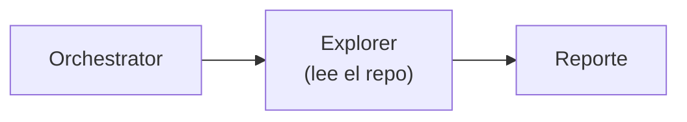
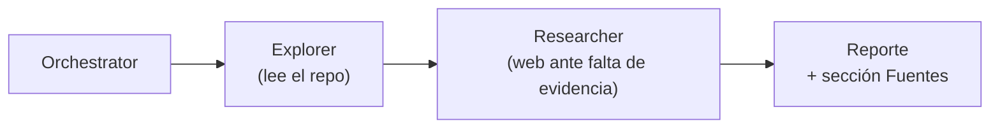

# Issue #12 — Subagente Researcher

Antes y después de la PR #12: cómo el pipeline pasó de **un solo subagente que
solo mira el repo** a **dos subagentes en secuencia, donde el segundo cubre la
falta de evidencia buscando en la web y devuelve fuentes atribuidas con su
origen**.

> Este doc explica **qué cambió y por qué**. Para el detalle del contrato de
> fuentes y los permisos, ver `agent/subagents/researcher.py` y la sección
> `agent/subagents/` en [`CLAUDE.md`](../CLAUDE.md).

## El problema

El pipeline multi-agente tenía **un único subagente**: el Explorer, que lee el
repo y describe estructura, dependencias y convenciones. Todo lo que decía el
reporte salía de lo que estaba **dentro** del repositorio.

Eso deja dos huecos que la consigna del TP pide cubrir:

1. **Nada cubre lo que el repo no dice.** Si para responder hace falta info
   externa (qué es una dependencia, una convención del ecosistema, un error
   conocido), el sistema no tenía a dónde ir: inventaba o se quedaba corto.
2. **No se distinguía el origen de lo afirmado.** Todo salía mezclado, sin marcar
   qué era evidencia leída y qué era inferencia. La consigna pide explícitamente
   **mostrar fuentes** y **distinguir origen** (repo / RAG / web / inferencia).

## El antes



Un solo paso. El reporte solo refleja lo que hay dentro del repo.

## El después

La PR suma el **Researcher**: un segundo subagente que corre **después** del
Explorer y, cuando la exploración no alcanza, **busca en la web** y devuelve la
respuesta con sus fuentes marcadas por origen.



El `run()` del orquestador deja de ser un solo llamado y se vuelve una
**secuencia de pasos** (`_explore` → `_research`), cada uno registrando su
resultado y sus fuentes en el `TaskState`. Sumar un subagente nuevo es agregar
otro paso, sin cambiar la forma.

### El Researcher, pieza por pieza

| Pieza | Qué hace |
|---|---|
| **`tool_map` acotado** | Solo `web_search` — igual que el Explorer solo tiene `read_file`/`list_files`. El rol se expresa en las tools que tiene. |
| **System prompt** | "Cuando falte evidencia, buscá en vez de inventar. Si `web_search` falla (sin `TAVILY_API_KEY`), no reintentes en loop: decí que no hubo evidencia web." |
| **Contrato de fuentes** | Emite cada fuente en una línea con formato fijo (ver abajo). |
| **`extract_sources`** | Parsea ese pie y devuelve `(origen, referencia)`; ignora líneas mal formadas en vez de romper. |

### El contrato de fuentes: por qué existe

El LLM **no puede** llamar a `state.record_source()` — solo produce texto. Así
que el Researcher emite sus fuentes en un pie parseable, y el orquestador las
extrae y las registra:

```
FUENTE: web | https://ejemplo.com/articulo
FUENTE: inferencia | razonamiento propio sin evidencia externa
```

`extract_sources()` convierte esas líneas en tuplas `(origen, referencia)`, y
`_research` hace el `state.record_source(...)` por cada una. Ese rodeo es lo que
hace que el reporte final gane una sección **Fuentes** con el origen marcado —
cumpliendo el requisito de la consigna de **distinguir origen** y **mostrar
fuentes**.

### Falta de evidencia, sin caso especial

Si el Researcher no recuperó ninguna fuente `web` (típicamente porque no hay
`TAVILY_API_KEY` y `web_search` es un stub), `_research` no trata el stub de
forma especial: simplemente anota una **observación de falta de evidencia** en el
estado. El degradado es natural — el mismo camino cubre "no había clave" y "la
búsqueda no trajo nada".

## Todavía sin RAG

Esta rebanada fija el **contrato** del Researcher y el manejo de fuentes, pero
usa la **web como única fuente externa**. El RAG (Chroma + embeddings) es #8:
cuando llegue, el Researcher va a consultar **primero** el RAG y recién después
caer a la web (el "RAG primero, web fallback" de la consigna). La forma ya está
lista para ese salto: es sumar una tool `retrieve` a su `tool_map` y un origen
`rag` al contrato de fuentes.

## Además de la PR original: dos correcciones

Al revisar la PR se sumaron dos cambios que la dejaron coherente con lo mergeado
en #11:

1. **Policies para el Researcher** (mismo invariante de [#11](./issue-11-policies.md)).
   El Researcher construía su `Harness` **sin** policies, reintroduciendo la
   asimetría que #11 había eliminado (un subagente fuera del gate por accidente de
   construcción). Hoy no cambiaba el comportamiento porque `web_search` no está
   gobernada, pero el día que gane una tool gobernada (o RAG) nacería
   desprotegido. Ahora `build_researcher(client, web_search, policies)` las
   inyecta, como el Explorer.

2. **Extracción de `_build_web_search_from_env`.** El setup de `web_search` (leer
   `TAVILY_API_KEY`, imprimir, `make_web_search`) quedaba **duplicado textual**
   entre `build_harness` y `build_orchestrator`. Se extrajo a un helper —al lado
   de `_build_client_from_env`— usado por ambas, unificando de paso el mensaje.

## Limitación conocida (aceptada, se resuelve en #8)

El contrato de fuentes depende de que el LLM emita un formato exacto por línea
(`FUENTE: <origen> | <referencia>`), y en la práctica **no lo cumple de forma
consistente**: según la corrida lo envuelve como lista markdown (`- FUENTE: ...`),
usa un encabezado plural (`FUENTES:`) con líneas peladas, o lo mete en prosa.
Cuando el formato no matchea, `extract_sources` no recupera nada y el reporte cae
al camino de "falta de evidencia" aunque sí hubiera fuentes.

Se decidió **no tapar esto parseando** cada variante (sería un pozo sin fondo y
código muerto ni bien cambie el modelo). La solución robusta es **salida
estructurada** (que el Researcher devuelva las fuentes como JSON vía tool-call,
no como texto libre), y se difiere a **#8**, donde el Researcher se rehace con
RAG. Hasta entonces la atribución de fuentes es best-effort.

## En una frase

Pasamos de *"un solo subagente que solo mira el repo"* a *"un pipeline de dos
pasos donde el Researcher cubre la falta de evidencia buscando en la web y
devuelve fuentes con su origen marcado"* — el contrato listo para que el RAG (#8)
se enchufe sin cambiar la forma.
