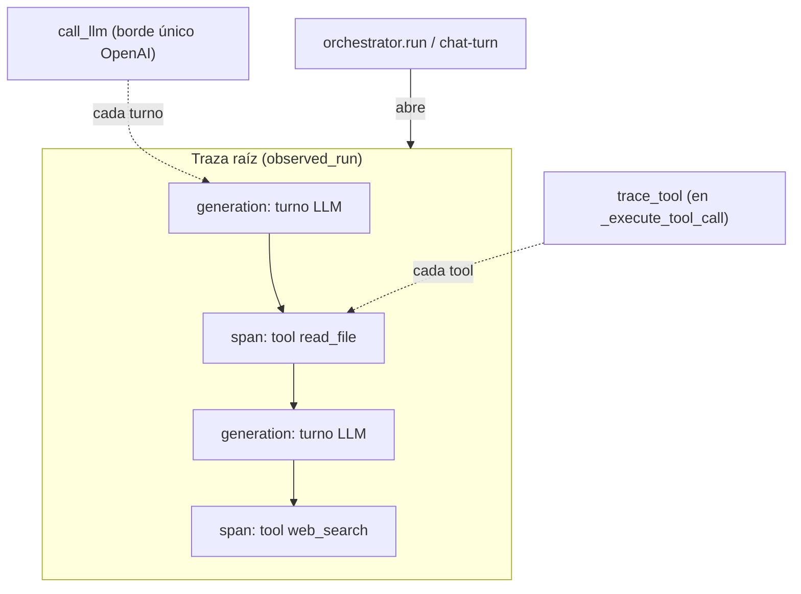

# Issue #13 — Observabilidad con Langfuse

Antes y después de la PR #13: cómo el agente pasó de **una caja negra** (solo
`print`s en la terminal) a **estar trazado en Langfuse** —prompts, modelo,
tokens, costo, latencia, tools y errores— **sin tocar el loop** y con
degradación a no-op si no hay credenciales.

> Este doc explica **qué cambió y por qué**. Para el detalle de la
> instrumentación, ver `agent/observability.py` y la sección
> `agent/observability.py` en [`CLAUDE.md`](../CLAUDE.md).

## El problema

El agente hacía llamadas al LLM y ejecutaba tools, pero no dejaba rastro
inspeccionable: lo único visible eran los `print`s en la consola. Para el TP se
pide **observabilidad** con una traza completa: prompts, modelo, llamadas LLM,
tools ejecutadas, iteraciones, errores, latencia, tokens y costo.

El desafío de diseño: instrumentar **sin ensuciar el loop** del `Harness` ni
duplicar el borde con OpenAI, y que **nunca** una falla de la instrumentación
(sin credenciales, lib faltante, red caída) tumbe una corrida del agente.

## El después

Se agrega `agent/observability.py`, un módulo fino que engancha en **tres puntos**
ya existentes, sin cambiar la forma del loop:



| Punto de enganche | Qué traza | Cómo |
|---|---|---|
| **`build_openai_client`** | cada turno LLM como `generation` (prompts, modelo, tokens, costo, latencia, errores) | envuelve el cliente con el drop-in `langfuse.openai.OpenAI`; `llm.build_client` delega acá |
| **`trace_tool`** | cada ejecución de tool como `span` (nombre, args, salida, latencia) | `Harness._execute_tool_call` llama `trace_tool(...)` en vez de la tool directa |
| **`observed_run`** | la traza raíz del caso de uso, donde anida todo lo anterior | context manager abierto por `orchestrator.run` ("analyze-repo") y por cada turno de chat en `main.py` ("chat-turn") |

### Sin agregar un segundo borde con OpenAI

La clave para no romper la consistencia del código: en vez de instrumentar
`call_llm` a mano, se **envuelve el cliente**. `build_client` sigue siendo el
único lugar que construye el cliente OpenAI, y ahora delega en
`observability.build_openai_client`, que decide si devolver el drop-in de Langfuse
o el cliente estándar. `call_llm` no se entera: sigue siendo el único borde con
OpenAI, ahora observable. (Respeta el principio "todos los turnos pasan por
`call_llm`" del CLAUDE.md.)

### Degradación elegante (requisito del issue)

Todo el módulo es **no-op sin credenciales**:

- Sin `LANGFUSE_PUBLIC_KEY` + `LANGFUSE_SECRET_KEY`, `_get_client()` devuelve
  `None` **antes de siquiera importar** Langfuse.
- Si la lib no está, si la autenticación falla, o si el drop-in rompe → también
  cae a `None` / cliente estándar.
- Con cliente `None`: `observed_run` es un context manager vacío, `trace_tool`
  ejecuta la tool directa, `build_openai_client` devuelve el OpenAI de siempre.

La instrumentación **jamás** tumba una corrida: es puro andamiaje alrededor del
agente, igual que Plan Mode o Supervisión.

### Config por entorno

```bash
# Todas opcionales — sin ellas, la instrumentación es no-op.
LANGFUSE_PUBLIC_KEY=pk-lf-...
LANGFUSE_SECRET_KEY=sk-lf-...
LANGFUSE_HOST=https://cloud.langfuse.com
```

## Además de la PR original: rebase y dos nits

Al integrarla (después de #11 y #12) se resolvió el rebase y se sumaron dos
ajustes:

1. **Rebase sobre #11 + #12.** El wrap de tools se reaplicó sobre el
   `_execute_tool_call` con gate de policies (#11), y `observed_run` pasó a
   envolver los dos pasos del pipeline (`_explore` → `_research`, #12), no el
   Explorer suelto.
2. **Plan Mode dentro de la traza.** En `main.py`, `observed_run("chat-turn")`
   ahora abre **antes** de Plan Mode, así la generation del planning también
   anida en la traza del turno (antes quedaba afuera).
3. **Docstring honesto de `trace_tool`.** Como las tools nunca levantan (devuelven
   `Error: ...` como string), se aclaró que el error de tool viaja en el output y
   que el span solo capturaría una excepción inesperada.

## Evidencia: una traza real

Corrida de `analyze.py "Qué hace este repo..."` con credenciales de Langfuse
presentes, vista en el dashboard:


Se ve la estructura de anidamiento que arma la instrumentación: la traza raíz
`analyze-repo` (abierta por `observed_run`), la `OpenAI-generation` con sus 6
turnos LLM (cada uno vía `call_llm` / el cliente instrumentado), y colgando de
ella los `span` de tools —`read_file` (3 veces), `list_files` (2) y
`web_search`— cada uno registrado por `trace_tool`.

## En una frase

Pasamos de *"una caja negra con `print`s"* a *"cada turno LLM y cada tool trazados
en una única traza por caso de uso"*, enganchado en los bordes que ya existían
(`build_client`, `_execute_tool_call`, `run`) y con no-op total si no hay
credenciales.
