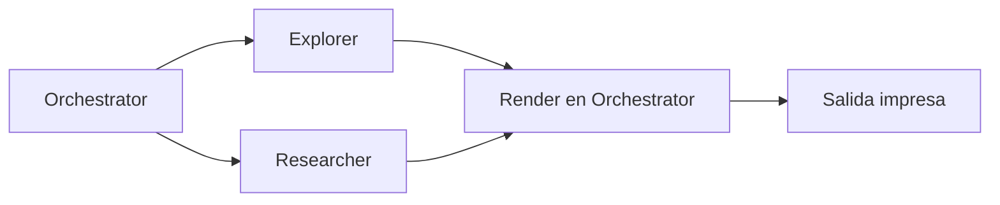
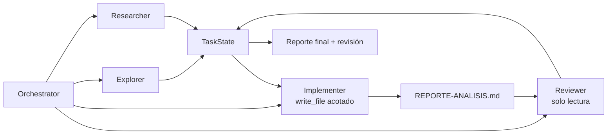

# Issue #4 — Implementer y Reviewer

Antes y después de la PR #4: cómo el pipeline pasó de **analizar y devolver un
mini-reporte en memoria** a **redactar un reporte persistido y revisarlo contra
el pedido original**.

> Este doc explica **qué cambió y por qué**. Para el detalle operativo, ver
> `agent/orchestrator.py`, `agent/subagents/implementer.py`,
> `agent/subagents/reviewer.py` y la sección `agent/subagents/` en
> [`CLAUDE.md`](../CLAUDE.md).

## El problema

Hasta #12/#8, el orquestador juntaba material con Explorer y Researcher y luego
renderizaba un reporte desde el propio `Orchestrator`. Eso dejaba dos huecos del
pipeline multi-agente:

1. **No había un subagente que produjera el artefacto final.** El reporte era una
   composición directa del orquestador, no una responsabilidad delegada.
2. **No había revisión independiente.** Nada verificaba que el reporte final
   respondiera al pedido original ni que las afirmaciones estuvieran respaldadas.
3. **No quedaba un archivo verificable.** El resultado se imprimía, pero no había
   un artefacto estable para revisar o entregar.

## El antes



El orquestador hacía demasiada composición final y no había ciclo
generar→revisar.

## El después

La PR agrega dos subagentes al final del pipeline:



El pipeline queda:

```text
_explore -> _research -> _implement -> _review
```

### Implementer

El Implementer recibe el material ya reunido en `TaskState`:

- pedido original;
- resultado del Explorer;
- resultado del Researcher;
- fuentes registradas.

Su única tool visible es `write_file`, pero está envuelta por el subagente para
aceptar únicamente:

```text
REPORTE-ANALISIS.md
```

Eso hace que la escritura sea realmente acotada por rol: aunque el LLM pida otro
path, la tool devuelve error y no escribe fuera del artefacto esperado. El
orquestador registra ese archivo con `state.record_modified_file(...)`.

### Reviewer

El Reviewer es solo lectura:

```text
read_file
list_files
```

Lee `REPORTE-ANALISIS.md`, valida que responda al pedido original y contrasta con
el repo si hace falta. Sus observaciones no se parsean desde texto libre: la
revisión termina con una tool privada:

```text
submit_review_result(veredicto, observaciones)
```

`observaciones` es una lista JSON de strings. `ReviewerSubagent` captura esa
tool-call y `extract_observations(self.reviewer)` expone las observaciones para
que el orquestador las registre en `TaskState`.

## Integración con #7 y #8

Esta PR fue rebaseada sobre memoria/contexto (#7) y RAG (#8). La integración
conserva:

- memoria persistente del Explorer (`read_memory` / `remember`);
- Researcher RAG-first (`retrieve` antes de `web_search`);
- fuentes estructuradas del Researcher (`submit_research_result`);
- `missing_evidence` separado de `observations`;
- eventos de loop registrados en `TaskState.observations`.

Implementer y Reviewer se suman al final sin reemplazar esos pasos.

## Además de la PR original: correcciones de review

Durante la revisión se agregaron dos ajustes:

1. **Escritura acotada real para Implementer.** La PR original le daba
   `write_file` completo; ahora el callable expuesto rechaza cualquier path que
   no sea `REPORT_FILENAME`.
2. **Observaciones estructuradas para Reviewer.** Se reemplazó el pie parseable
   `OBSERVACION: ...` por `submit_review_result`, siguiendo el mismo criterio de
   robustez usado para las fuentes del Researcher.

## Verificación

Checks rápidos:

```bash
/home/n-mangini/projects/universidad/ia/coding-agent/.venv/bin/python \
  -m compileall agent rag analyze.py main.py run_tests.py repo.py
```

Chequeos locales esperados:

```bash
/home/n-mangini/projects/universidad/ia/coding-agent/.venv/bin/python -c \
  "from agent.subagents.implementer import build_implementer, REPORT_FILENAME; print(REPORT_FILENAME)"
```

Smoke e2e:

```bash
/home/n-mangini/projects/universidad/ia/coding-agent/.venv/bin/python \
  analyze.py "Analizá este repo"
```

Con cuota OpenAI disponible, el flujo esperado es que el Implementer escriba
`REPORTE-ANALISIS.md`, el Reviewer lo lea y el reporte impreso incluya la capa
de revisión.

## En una frase

Pasamos de *"el orquestador arma un mini-reporte en memoria"* a *"un
Implementer escribe un artefacto Markdown y un Reviewer lo valida con
observaciones estructuradas en `TaskState`"*.
