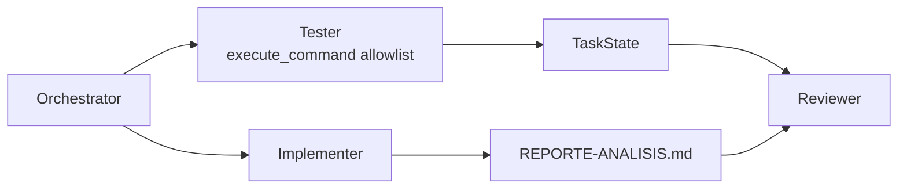

# Issue #5 — Tester con checks acotados

Antes y después de la PR #5: cómo el pipeline pasó de **generar y revisar un
reporte sin ejecutar validaciones** a **correr un check real acotado y dejar su
resultado en `TaskState` para que el Reviewer lo considere**.

> Este doc explica **qué cambió y por qué**. Para el detalle operativo, ver
> `agent/subagents/tester.py`, `agent/orchestrator.py` y la sección
> `agent/subagents/` en [`CLAUDE.md`](../CLAUDE.md).

## El problema

Después de Implementer + Reviewer, el pipeline ya producía un artefacto y lo
revisaba, pero todavía faltaba una validación ejecutable:

1. **No había subagente Tester.** Ningún paso ejecutaba checks reales del repo.
2. **El Reviewer no tenía evidencia de ejecución.** Solo podía leer y razonar
   sobre el reporte, sin considerar si el código cargaba.
3. **`execute_command` completo sería demasiado amplio.** Un Tester con shell
   libre podría ejecutar cualquier comando, aunque su rol solo necesita checks
   controlados.
4. **Un check fallido no debía romper el pipeline.** La consigna pide reflejarlo
   como observación, no abortar toda la corrida.

## El después

Se agrega un quinto paso:

```text
_explore -> _research -> _implement -> _test -> _review
```



### Tester

El Tester es un `Harness` especializado con una única tool visible:

```text
execute_command
```

Pero no recibe el shell general. `build_tester()` envuelve esa tool y solo
permite comandos de `ALLOWED_TEST_COMMANDS`. El check inicial es:

```bash
python3 -m compileall agent rag analyze.py main.py run_tests.py repo.py
```

Ese check es deliberadamente conservador: no hace llamadas LLM, no instala
dependencias y detecta errores de sintaxis/import básicos en los módulos del
proyecto.

### Registro en estado

`Subagent.run()` ya registra el resultado final del Tester en:

```python
state.subagent_results["tester"]
```

El orquestador además inspecciona el resultado con `_check_failed(...)`; si ve un
fallo (`Command failed`, `Error:`, `Traceback`), agrega una observación:

```python
state.record_observation("Tester: check fallido. ...")
```

Así un check fallido queda visible para el Reviewer y para el reporte final, pero
no corta el pipeline.

### Reviewer considera el check

El paso `_review` ahora incluye:

```text
Resultado del Tester:
...
```

en la tarea que recibe el Reviewer. De esa forma la revisión final no mira solo
el Markdown generado, sino también el resultado del check acotado.

## Verificación

Checks rápidos:

```bash
/home/n-mangini/projects/universidad/ia/coding-agent/.venv/bin/python \
  -m compileall agent rag analyze.py main.py run_tests.py repo.py
```

Chequeo directo del allowlist:

```bash
/home/n-mangini/projects/universidad/ia/coding-agent/.venv/bin/python -c \
  "from agent.subagents.tester import build_tester, DEFAULT_TEST_COMMAND; t=build_tester(None); tool=t.harness.tool_map['execute_command']; assert tool('rm -rf .').startswith('Error:'); print(tool(DEFAULT_TEST_COMMAND))"
```

Smoke e2e:

```bash
/home/n-mangini/projects/universidad/ia/coding-agent/.venv/bin/python \
  analyze.py "Analizá este repo"
```

Con `.env` configurado, el pipeline debe ejecutar el Tester después del
Implementer y antes del Reviewer. El reporte final debe incluir la sección
**Checks (Tester)**.

## En una frase

Pasamos de *"generar y revisar sin ejecutar nada"* a *"un Tester ejecuta un check
real por allowlist, deja el resultado en `TaskState` y el Reviewer lo considera"*.
