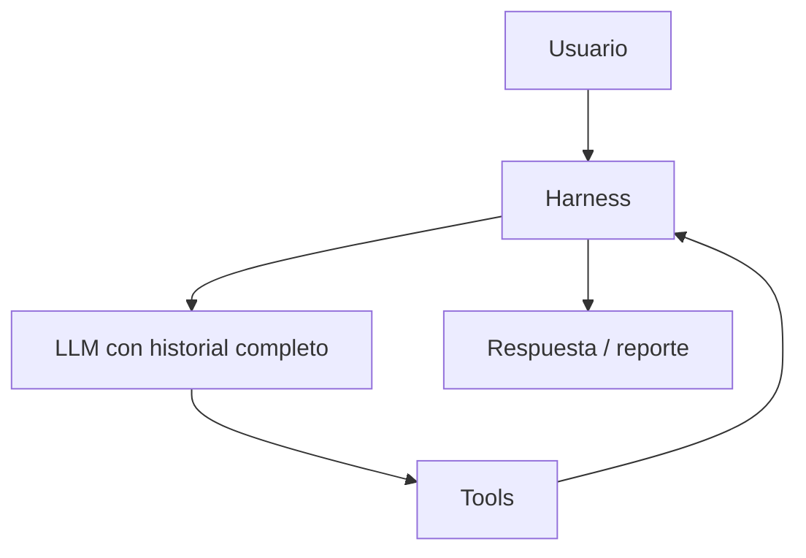
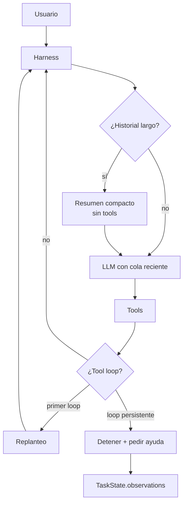

# Issue #7 — Memoria y manejo de contexto

Antes y después de la PR #7: cómo el agente pasó de **no recordar nada entre
corridas y reenviar todo el historial** a **tener memoria persistente por
proyecto, resumir contexto largo y detectar loops de tools con una acción
observable en el estado compartido**.

> Este doc explica **qué cambió y por qué**. Para el detalle operativo, ver
> `agent/memory.py`, `agent/harness.py` y las secciones correspondientes en
> [`CLAUDE.md`](../CLAUDE.md).

## El problema

El pipeline podía analizar un repo, pero cada corrida arrancaba desde cero y el
loop del `Harness` crecía sin límite:

1. **No había memoria persistente.** Si el Explorer ya había descubierto la
   arquitectura, dependencias o convenciones del proyecto, esa información se
   perdía al terminar la ejecución. La siguiente corrida volvía a pagar el costo
   de descubrir lo mismo.
2. **El historial se reenviaba completo.** En conversaciones largas, el agente
   seguía pasando todos los turnos anteriores al LLM. Eso aumenta tokens, costo y
   riesgo de superar ventana de contexto.
3. **Un loop de tools no dejaba una señal útil.** Si el LLM repetía la misma
   llamada una y otra vez, no había una intervención explícita de cambio de
   estrategia ni una marca en `TaskState` para que el reporte mostrara que el
   agente se trabó.
4. **La falta de evidencia quedaba mezclada.** `observations` juntaba dudas,
   riesgos y evidencia faltante, cuando la consigna pide reconocer claramente lo
   que no se pudo verificar.

## El antes



Cada corrida era amnésica: no había archivo de memoria, no había compactación de
contexto y la única salida visible de un atasco era lo que pasara en consola.

## El después

La PR agrega tres salvaguardas transversales: **memoria**, **resumen de
historial** y **detección de loops**.



### Memoria persistente por proyecto

Se agrega `agent/memory.py`, con una memoria JSON en la raíz del proyecto
analizado:

```text
.agent_memory.json
```

Ese archivo está git-ignorado y vive en el `cwd`. Después de `clone_repo`, el
`cwd` es la raíz del repo clonado, así que la memoria queda naturalmente
separada por proyecto sin necesitar un índice global.

| Pieza | Qué hace |
|---|---|
| **`ProjectMemory`** | Guarda listas de notas cortas por categoría y persiste en JSON. |
| **`CATEGORIES`** | Fuente de verdad de categorías (`arquitectura`, `dependencias`, `comandos`, `convenciones`, `decisiones`, `bugs`, `resumenes`). |
| **`load_project_memory()`** | Carga el JSON o arranca vacío si no existe o está corrupto. La memoria ayuda, no tumba una corrida. |
| **`make_memory_tools()`** | Construye `read_memory` y `remember` cerradas sobre la misma instancia de memoria. |

Las tools nuevas son:

```text
read_memory() -> devuelve la memoria renderizada como contexto para el LLM
remember(categoria, nota) -> agrega una nota deduplicada y guarda el JSON
```

El Explorer recibió esas tools junto a sus tools de lectura. Su prompt le pide
leer memoria al empezar y guardar solo hallazgos estables, para no llenar el JSON
con observaciones efímeras.

### Manejo de contexto

`Harness.run_conversation()` ahora llama a `_manage_context()` antes de cada
turno LLM. Si el historial supera `HISTORY_LIMIT`, conserva:

1. el system message original;
2. un único `system` con el resumen de los turnos viejos;
3. una cola reciente de mensajes sin partir grupos de tool calls.

La cola se calcula con `_safe_tail_boundary()` para no dejar un mensaje
`role:"tool"` huérfano al inicio de la ventana preservada, porque la API espera
que cada tool output esté precedido por el assistant que pidió esa tool.

El resumen se pide por el mismo borde de siempre (`call_llm`) y sin tools
(`tools=None`), igual que Plan Mode. Si resumir falla, el historial queda intacto:
la compactación es una optimización, no un invariante funcional.

### Detección de loops

La PR suma `detect_loop(signatures, threshold)`, una función pura que marca loop
cuando las últimas `threshold` firmas de tool call son idénticas. La firma es el
nombre de la tool más sus argumentos crudos.

La intervención ocurre en dos niveles:

| Momento | Acción |
|---|---|
| **Primer loop** | Inyecta un mensaje de replanteo y limpia el rastro de firmas para darle otra chance. |
| **Loop persistente** | Detiene la corrida con un mensaje explícito de bloqueo y pedido de ayuda. |

Esto evita que el agente siga gastando llamadas en la misma acción cuando ya no
está avanzando.

### Falta de evidencia explícita

`TaskState` ahora separa:

| Campo | Uso |
|---|---|
| **`observations`** | Dudas, riesgos y eventos transversales de la ejecución. |
| **`missing_evidence`** | Cosas que el sistema reconoce que no pudo verificar. |

El reporte renderiza una sección propia de **Falta de evidencia**. Eso hace más
honesta la salida: no queda mezclado un riesgo general con una afirmación que no
pudo respaldarse.

## Además de la PR original: corrección de review

En la revisión se sumó un ajuste para cumplir mejor el requisito de que los loops
sean observables en el estado compartido:

- `Harness` ahora expone `loop_events`, reiniciado en cada `run_conversation`.
- `_intervene_on_loop()` agrega un evento cuando pide replanteo y otro cuando
  detiene por loop persistente.
- `Subagent.run()` copia esos eventos a `TaskState.observations` con el nombre
  del subagente.

Antes de ese ajuste, el loop se veía por `print()` y por el historial local del
`Harness`, pero no quedaba garantizado en el `TaskState` que usa el reporte.

## Verificación

Se verificó la PR con tres niveles:

1. **Compilación rápida**

   ```bash
   /home/n-mangini/projects/universidad/ia/coding-agent/.venv/bin/python \
     -m compileall agent analyze.py main.py run_tests.py repo.py
   ```

2. **Chequeo unitario mínimo del detector**

   ```bash
   /home/n-mangini/projects/universidad/ia/coding-agent/.venv/bin/python -c \
     "from agent.harness import detect_loop; assert detect_loop(['a','a','a'], 3); assert not detect_loop(['a','b','a'], 3); assert not detect_loop(['a','a'], 3)"
   ```

3. **Smoke e2e**

   ```bash
   /home/n-mangini/projects/universidad/ia/coding-agent/.venv/bin/python \
     analyze.py "Analizá este repo"
   ```

   Con `.env` configurado, el Explorer leyó `read_memory`, usó tools de lectura y
   produjo el análisis; el Researcher llamó `web_search` y Tavily devolvió
   resultados reales. El reporte final incluyó una fuente de origen `web`.

## En una frase

Pasamos de *"cada corrida arranca de cero, el historial crece sin límite y los
loops solo se ven en consola"* a *"memoria JSON por proyecto, contexto resumido y
loops que replantean o se detienen dejando evidencia en `TaskState`"*.
