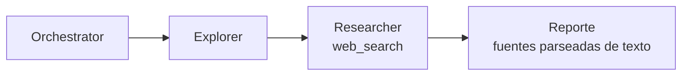
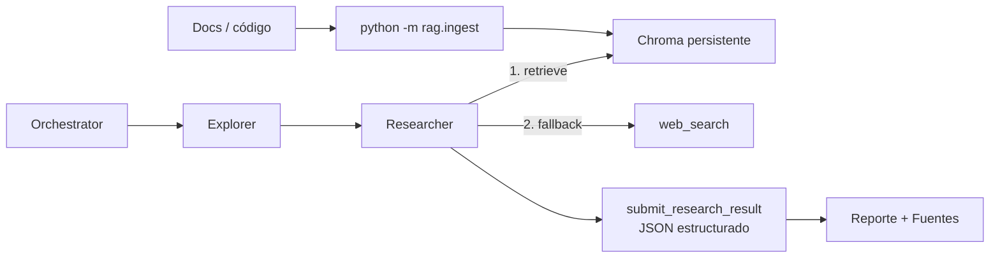

# Issue #8 — RAG con Chroma y Researcher RAG-first

Antes y después de la PR #8: cómo el Researcher pasó de **buscar solo en la web
cuando faltaba evidencia** a **consultar primero un índice RAG local sobre
Chroma, caer a web solo si hace falta y devolver fuentes estructuradas**.

> Este doc explica **qué cambió y por qué**. Para el detalle operativo, ver
> `rag/`, `agent/tools.py`, `agent/subagents/researcher.py` y las secciones
> correspondientes en [`CLAUDE.md`](../CLAUDE.md).

## El problema

El Researcher de #12 cubría la falta de evidencia con `web_search`, pero todavía
no cumplía el requisito RAG del TP:

1. **No había recuperación local.** Si la evidencia estaba en docs o archivos ya
   conocidos del proyecto, el sistema dependía de la web o de inferencia.
2. **No había índice vectorial.** Faltaba chunking, embeddings y persistencia para
   consultar documentos por similitud.
3. **El fallback no tenía orden.** La consigna pide RAG primero y web después,
   distinguiendo el origen de cada fuente.
4. **El contrato de fuentes era frágil.** El Researcher emitía líneas de texto
   `FUENTE: <origen> | <referencia>`, y el orquestador las parseaba best-effort.
   Esa forma ya había quedado marcada como limitación conocida en #12.

## El antes



El único origen externo real era `web`, y las fuentes dependían de que el LLM
respetara un pie de texto exacto.

## El después

La PR agrega un pipeline RAG explícito y cambia el orden de investigación:



### Pipeline RAG

El paquete `rag/` vive fuera de `agent/` porque es infraestructura de
recuperación que el agente usa mediante una tool, no parte del loop del
`Harness`.

| Pieza | Qué hace |
|---|---|
| **`rag/chunking.py`** | Parte documentos en ventanas de caracteres con solapamiento. |
| **`rag/embeddings.py`** | Genera embeddings con `text-embedding-3-small` usando el cliente OpenAI compartido. |
| **`rag/store.py`** | Abre una colección Chroma persistente, ingesta chunks y consulta por similitud. |
| **`rag/ingest.py`** | CLI `python -m rag.ingest <path>` para poblar el índice desde archivos o carpetas. |

La persistencia se controla con:

```bash
RAG_PERSIST_DIR=./rag_store
```

`rag_store/` está git-ignorado. Si `chromadb` no está instalado,
`make_rag_store()` devuelve `None` y la tool `retrieve` degrada a stub, igual que
`web_search` sin `TAVILY_API_KEY`.

### Tool `retrieve`

`retrieve(query, k=4)` se arma con `make_retrieve(rag_store)` en `agent/tools.py`.
Devuelve chunks relevantes con una línea de fuente RAG por bloque:

```text
FUENTE_RAG: docs/archivo.md (distancia 0.1234)
texto del chunk...
```

Esa marca no es el contrato final de fuentes del reporte: es contexto para que el
Researcher pueda registrar una fuente `rag` estructurada.

### Researcher RAG-first

El Researcher ahora tiene dos herramientas de evidencia:

| Tool | Orden | Uso |
|---|---|---|
| **`retrieve`** | primero | Buscar evidencia en el índice Chroma local. |
| **`web_search`** | fallback | Buscar afuera solo si el RAG no alcanza. |

El prompt prohíbe saltar directo a web cuando el RAG ya respondió y pide no
reintentar en loop si una tool devuelve error de disponibilidad.

### Fuentes estructuradas

La revisión reemplazó el pie textual `FUENTE: ...` por una tool privada del
Researcher:

```text
submit_research_result(respuesta, fuentes)
```

`fuentes` es una lista JSON con objetos:

```json
[
  {"origen": "rag", "referencia": "docs/plan-tp-final.md"},
  {"origen": "web", "referencia": "https://example.com"}
]
```

`ResearcherSubagent` captura esa tool-call, expone `sources`, y el orquestador
usa `extract_sources(self.researcher)` para registrar las fuentes en
`TaskState`. Así se evita depender de un formato libre generado por el LLM.

## Integración con #7

Esta PR fue rebaseada sobre memoria/contexto (#7). La integración conserva:

- `memory_tools` para el Explorer en `build_orchestrator`.
- `read_memory` / `remember` en el harness genérico.
- `record_missing_evidence` y la sección **Falta de evidencia** del reporte.
- eventos de loop copiados desde cada subagente a `TaskState.observations`.

RAG se suma encima de esa base: no reemplaza memoria, la complementa como otra
fuente distinguible (`memoria` vs `rag`).

## Verificación

Checks rápidos:

```bash
/home/n-mangini/projects/universidad/ia/coding-agent/.venv/bin/python \
  -m compileall agent rag analyze.py main.py run_tests.py repo.py
```

Ingesta esperada:

```bash
/home/n-mangini/projects/universidad/ia/coding-agent/.venv/bin/python \
  -m rag.ingest docs
```

Smoke e2e:

```bash
/home/n-mangini/projects/universidad/ia/coding-agent/.venv/bin/python \
  analyze.py "Analizá este repo"
```

Con `.env` configurado e índice poblado, el Researcher debe llamar primero a
`retrieve`; si recupera chunks útiles, debe registrar fuentes `rag` mediante
`submit_research_result`. Si el índice está vacío o Chroma no está disponible,
debe caer a `web_search` y registrar fuentes `web` o una falta de evidencia.

## En una frase

Pasamos de *"Researcher web-only con fuentes parseadas de texto"* a *"Researcher
RAG-first con Chroma persistente, fallback web y fuentes JSON estructuradas"*.
