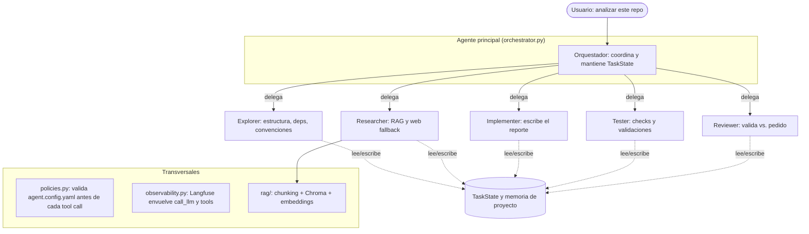

# Plan — TP Final: Coding Agent Avanzado

Plan de evolución del coding agent base hacia un sistema multi-agente, **sin
frameworks de orquestación** (prohibidos LangChain, LangGraph, CrewAI, AutoGen).
Consigna completa: `TP_Final_Coding_Agent_Avanzado_Consigna_Documento.pdf`.

## Decisiones del grupo

| Decisión | Elección |
|---|---|
| Ecosistema / especialización | **Python** |
| Caso de uso | **Analizar un repo desconocido → reporte** (arquitectura, dependencias, riesgos, comandos). Resultado verificable, bajo riesgo de escritura. |
| Observabilidad | **Langfuse** |
| RAG (vector store + embeddings) | **Chroma + OpenAI embeddings** (`text-embedding-3-small`) |

## Punto de partida (ya existe)

Harness loop, tools base (`read_file`, `list_files`, `write_file`,
`execute_command`, `web_search`), Plan Mode, Supervisión, config por env.
Ya refactorizado y desacoplado (ver `README.md`).

## Arquitectura objetivo

Idea central que mantiene todo consistente y libre de frameworks: **cada
subagente es un `Harness` con su propio system prompt, su `tool_map` restringido
y sus permisos**. El agente principal (orquestador) es un loop de más alto nivel
que **delega en los subagentes como si fueran tools**, pasando un **estado
compartido** (`TaskState`).



### Estructura de archivos propuesta

Respeta la cohesión de `agent/` (todo lo que es el agente vive adentro; el setup
del entorno queda afuera, como `repo.py`).

```
agent/
  harness.py, llm.py, tools.py, factory.py   # base (ya está)
  orchestrator.py     # agente principal
  subagents/          # explorer / researcher / implementer / tester / reviewer
  state.py            # TaskState compartido
  memory.py           # memoria persistente por proyecto (JSON)
  policies.py         # carga + valida agent.config.yaml
  observability.py    # Langfuse
  rag/                # ingest, chunking, store Chroma, retrieve
agent.config.yaml
```

### Dónde engancha cada cosa

- **Políticas** → dentro de `harness._execute_tool_call`, antes de ejecutar la
  tool. (Es el método que ya aislamos en el refactor.)
- **Observabilidad** → envolviendo `call_llm` (único borde con OpenAI) y las tools.
- **Subagentes** → `Harness` + prompt + `tool_map` acotado. Reuso directo del motor.

### Rol de cada subagente (según consigna)

| Subagente | Responsabilidad | Tools/permisos (tentativo) |
|---|---|---|
| Explorer | Entiende el repo: estructura, arquitectura, dependencias, convenciones, archivos relevantes | solo lectura + exploración |
| Researcher | Busca en el RAG y, si hace falta, en la web | `retrieve` (RAG) + `web_search` |
| Implementer | Propone/realiza cambios (en este caso: escribe el reporte) | escritura acotada |
| Tester | Valida con checks del grupo (tests, build, lint, logs) | `execute_command` acotado |
| Reviewer | Revisa el diff/cambios y valida que respondan al pedido | solo lectura |

## Plan por fases

Cada fase es entregable y testeable por separado.

| Fase | Qué | Por qué en este orden |
|---|---|---|
| **1. Walking skeleton** | `TaskState` + orquestador + **un** subagente (Explorer) que produce un mini-reporte | Probar la forma multi-agente end-to-end antes de sumar capacidades |
| **2. Resto de subagentes** | Researcher, Implementer, Tester, Reviewer con permisos por rol | Completa el pipeline del caso de uso |
| **3. Config + políticas** | `agent.config.yaml` validado antes de cada tool call | Transversal; temprano para que todo lo nuevo nazca seguro |
| **4. Observabilidad** | Langfuse sobre `call_llm` + tools | Transversal; instrumentar antes de que crezca la superficie |
| **5. RAG** | Ingesta de docs Python → Chroma; tool `retrieve`; mostrar fuentes; RAG→web fallback | El Researcher se vuelve real |
| **6. Memoria + manejo de contexto** | Memoria persistente por proyecto; resumen de historial; detección de loops | Requisitos avanzados de comportamiento |
| **7. Cierre** | Caso de uso, 2 tareas de evidencia, capturas Langfuse, README de entregables, reflexión | Entregables |

## Requisitos de la consigna (checklist)

- [ ] Agente principal + 5 subagentes con responsabilidad clara y permisos por rol
- [ ] Estado compartido de tarea (pedido, avance, resultados de subagentes, fuentes, archivos modificados, observaciones)
- [ ] Memoria persistente por proyecto (arquitectura, deps, comandos, convenciones, decisiones, bugs, resúmenes)
- [ ] RAG: chunking + embeddings + vector store; mostrar fuentes; RAG primero, web fallback; distinguir origen (repo/memoria/RAG/web/inferencia)
- [ ] Manejo de contexto: resumir historial, no mandar todo el repo/historial; detección de loops → replanificar/detener/pedir ayuda; reconocer falta de evidencia
- [ ] `agent.config.yaml` con políticas (read/write/commands/approval) validadas antes de cada tool call
- [ ] Observabilidad (Langfuse) usada en al menos una prueba: prompts, modelo, llamadas LLM, tools, docs recuperados, búsquedas web, iteraciones, errores, latencia, tokens, costo, resultado
- [ ] Caso de uso con resultado verificable
- [ ] Pruebas: RAG con fuentes, memoria, cambio de estrategia/pedir ayuda, traza de observabilidad
- [ ] (Opcional) Sistema de plugins para tools

## Entregables

1. Código completo y funcionando (construido sobre el agent base).
2. README con instalación, configuración y ejecución.
3. Descripción del caso de uso (repo usado, objetivo, criterio de cumplimiento).
4. Explicación de arquitectura (rol del principal, de cada subagente, estructura del estado compartido).
5. Documentación de la base RAG (fuentes, chunking, embeddings, almacenamiento).
6. Evidencia de ≥2 tareas ejecutadas (output, fuentes recuperadas, explicación).
7. Capturas de observabilidad con ≥1 traza completa.
8. Reflexión (qué funcionó, qué falló, loops/falta de evidencia detectados, mejoras).
